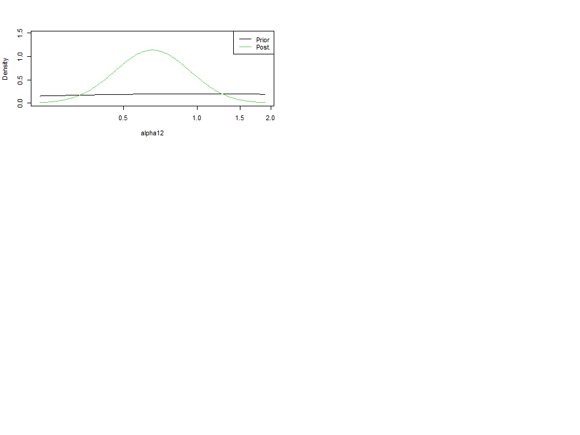

-   [1．Set parameters
    パラメータの設定](#set-parameters-パラメータの設定)
-   [2．Read in data データの読み込み](#read-in-data-データの読み込み)
-   [3．Apply data and pars for SPiCT
    解析に用いるデータの指定とSPiCT用の変数に変換](#apply-data-and-pars-for-spict-解析に用いるデータの指定とspict用の変数に変換)
-   [4．Plot input data
    データのプロット](#plot-input-data-データのプロット)
-   [5．Set time interval 時間幅の設定](#set-time-interval-時間幅の設定)
-   [6．実行と結果の要約](#実行と結果の要約)
-   [7．結果のプロットと推定パラメータの事前分布と事後分布図](#結果のプロットと推定パラメータの事前分布と事後分布図)
-   [9．Retrospective plots
    レトロ解析のやり方例](#retrospective-plots-レトロ解析のやり方例)

1．Set parameters パラメータの設定
==================================

``` r
#詳しい説明はspict_guidelines.pdfやspict_handbook.pdfを参照してください

#devtools::install_github("DTUAqua/spict/spict") #パッケージのインストール

library(spict)#ライブラリーの読み込み  
library(dplyr)
library(tidyr)

#1-1 各種パラメータの設定----
#-------------------------------------------------
## 使用する漁獲量の種類数(通常は1です．2以上はまだ未対応)
n_catch <- 1

## 使用する資源量指標値の種類数(資源量指標値が一つなら1, 二つなら2, 3以上はまだ未対応)
n_cpue <- 2

## 個体群動態に関するパラメータ----　
### 内的自然増加率(r)に関する事前分布を指定.例えば，平均=0.5，sd=2の対数正規分布を与える場合は，c(log(0.5),2)のように，平均，sdの順に与える.三つ目の入力はこの事前分布を使う（1）か使わないか(0)を指定．よって使うならc(log(0.5),2,1),使わないならc(log(0.5),2,0)となる
prior_r <- c(log(0.5),2,1)

### 余剰生産曲線の形を決めるshape parameterに関する事前分布を指定．例えば，shaefer型にほぼ固定したい場合は，c(log(2),1e-3)とする.SPiCTではデフォルトでsemi-informative prior(=c(log(2),2))を与えている.三つ目の入力はこの事前分布を使う（1）か使わないか(0)の指定．よって，c(log(2),2,0)とした場合はdefaultの設定も用いない完全なる無情報となる．
prior_shape <- c(log(2),1e-3,1)

###  環境収容量(K)に関する事前分布を指定．例えば，平均=1000，sd=2の対数正規分布を与える場合は，c(log(1000),2)のように，平均，sdの順に与える.三つ目の入力はこの事前分布を使う（1）か使わないか(0)の指定
prior_K <- c(log(1000),2,1)

### 初期資源量のKに対する割合(P1, SPictではbkfracと呼ぶ)に関する事前分布を指定．例えば，データがある以前にほとんど漁獲がないことがわかっている場合などは，平均=0.8, sd=0.5の対数正規分布を与える(c(log(0.8),0.5). そうではなく，データがある以前に漁獲が盛んだった場合などは，平均=0.2, sd=0.5の対数正規分布を与えるc(log(0.2),0.5).三つ目の入力はこの事前分布を使う（1）か使わないか(0)の指定
prior_P1 <- c(log(0.8),0.5,1)

## 漁獲，漁獲量に関するパラメータ----　
### 漁獲係数(F)のプロセス誤差(sdf)に関する事前分布を指定．例えば，平均=0.3, sd=2の対数正規分布を与える場合はc(log(0.3),2)のように，平均,sdの順に与える.三つ目の入力はこの事前分布を使う（1）か使わないか(0)の指定.SPiCTの場合は，beta(=sdc/sdf)として事前分布を与えることも多い．betaとしてのみ事前分布を与える場合は三つ目の入力は0として，betaを後段で指定する.
prior_sdf <- c(log(0.3),2,0)

### 漁獲量(C)の観測誤差(sdc)関する事前分布を指定．例えば，平均=0.3, sd=2の対数正規分布を与える場合はc(log(0.3),2)のように，平均,sdの順に与える．三つ目の入力はこの事前分布を使う（1）か使わないか(0)の指定.SPiCTの場合は，beta(=sdc/sdf)として事前分布を与えることも多い．betaとしてのみ事前分布を与える場合は三つ目の入力は0として，betaを後段で指定する.
prior_sdc <- c(log(0.3),2,0)

### 【SPiCTのみの設定】beta(=sdc/sdf)に関する事前分布を指定．多くの場合(default)は，平均=1, sd=2の対数正規分布が与えられ，その場合はc(log(1),2)のように，平均,sdの順に与える.三つ目の入力はこの事前分布を使う（1）か使わないか(0)の指定.
prior_beta <- c(log(1),2,1)

## 資源量，資源量指標値に関するパラメータ----　
### 資源量(B)のプロセス誤差(sdb)に関する事前分布を指定．例えば，平均=0.3, sd=2の対数正規分布を与える場合はc(log(0.3),2)のように，平均,sdの順に与える．三つ目の入力はこの事前分布を使う（1）か使わないか(0)の指定.SPiCTの場合は，alpha(=sdi/sdb)として事前分布を与えることも多い．alphaとして事前分布を与える場合は三つ目の入力は0として，alphaを後段で指定する.
prior_sdb <- c(log(0.3),2,0)

### 資源量指標値(I)の観測誤差(sdi)に関する事前分布を指定．例えば，平均=0.3, sd=2の対数正規分布を与える場合はc(log(0.3),2)のように，平均,sdの順に与える.三つ目の入力はこの事前分布を使う（1）か使わないか(0)の指定.SPiCTの場合は，alpha(=sdi/sdb)として事前分布を与えることも多い．alphaとして事前分布を与える場合は三つ目の入力は0として，alphaを後段で指定する.
prior_sdi <- c(log(0.3),2,0)

### 【SPiCTのみの設定】alpha(=sdi/sdb)に関する事前分布を指定．多くの場合は，平均=1, sd=2の対数正規分布が与えられ，その場合はc(log(1),2)のように，平均,sdの順に与える.三つ目の入力はこの事前分布を使う（1）か使わないか(0)の指定.
prior_alpha <- c(log(1),2,1)

###複数の資源量指標値(I)があったときに，Iの観測誤差(sdi)をいくつかの指標値で同一にする(1)かしないか(0)．0の場合は，それぞれの資源量指標値ごとのsdiが推定される．
set_mapsdi <-0
### set_mapsdiが１のとき，Iの観測誤差(sdi)を同一にしたい指標値をmapsdiで指定できる．例えば，Iが二つあったときに，I1とI2で同一のCVを推定したい場合はc(1,1)とする．またそれぞれ別々に推定したい場合はc(1,2)と指定．資源量指標値が三つあり，sdi1とsdi2はCVが等しく，sdi3のCVは別に推定させる場合はc(1,1,2)とする．mapsdiの長さは，指標値の数と同じでなければならない．
mapsdi <-c(1,1)

### 資源量指標値(I)の漁獲効率(q)に関する事前分布を指定．例えば，平均=0.8, sd=2の対数正規分布を与える場合はc(log(0.3),2)のように，平均,sdの順に与える．三つ目の入力はこの事前分布を使う（1）か使わないか(0)の指定.（現時点では，資源量指標値ごとにpriorを与えることはできなそう）
prior_q <- c(log(0.8),2,0)
```

2．Read in data データの読み込み
================================

``` r
#共通の例データ(example1.csv)をSPiCT用のデータ形式に変換するコード
#変換されたデータセットをtest_dataという名前に置き換える

data<-read.csv("example1.csv")
#
data_noCV<-data %>% select(-CV,-Weight,-Memo) #とりあえずCV,wight,memoの情報は取り除く
use_data<-spread(data_noCV,key=Fleet,value=Value)

get_C<- use_data %>% filter(Label=="Catch")
C_data <- get_C %>% select(Year,All)
colnames(C_data)<-c("timeC","obsC")

get_I<- use_data %>% filter(Label=="Index")
I_data <- get_I %>% select(Year,Longline,PurseSeine)
colnames(I_data)<-c("timeI1","obsI1","obsI2")

test_data<-cbind(C_data,I_data)
test_data<-as.list(test_data) #リスト形式に変換　

#各資源量指標値のCVの抽出
 LL<- data %>% select(Year,Fleet,CV) %>% filter(Fleet=="Longline")
 PS<- data %>% select(Year,Fleet,CV) %>% filter(Fleet=="PurseSeine")
 obsI1_CV<-LL$CV[[1]] #LonglineのCV
 obsI2_CV<-PS$CV[[1]] #PurseSeineのCV
 
#用いる資源量指標値とそれに対応すするtimeを選ぶ

if(n_cpue==2){
#Fitする資源量指標値が二つの場合----
test_data$obsI<-list()
test_data$obsI[[1]]<-test_data$obsI1
test_data$obsI[[2]]<-test_data$obsI2
test_data$timeI<-list()
test_data$timeI[[1]]<-test_data$timeI1
test_data$timeI[[2]]<-test_data$timeI1
}else{
#使用したい資源量指標値が一つの場合----
sum_obsI1<-sum(test_data$obsI1,na.rm=TRUE)
sum_obsI2<-sum(test_data$obsI2,na.rm=TRUE)
if(sum_obsI1>sum_obsI2)test_data$obsI<-test_data$obsI1 
if(sum_obsI1<sum_obsI2)test_data$obsI<-test_data$obsI2 
test_data$timeI<-test_data$timeI1
}
```

3．Apply data and pars for SPiCT 解析に用いるデータの指定とSPiCT用の変数に変換
==============================================================================

``` r
inp <- test_data #test_dataをinputデータとして与える．

inp$priors$logr <- prior_r
inp$priors$logn <- prior_shape
inp$priors$logK <- prior_K
inp$priors$logbkfrac <- prior_P1
inp$priors$logsdf <- prior_sdf
inp$priors$logsdc <- prior_sdc
inp$priors$logbeta <- prior_beta
inp$priors$logsdb <- prior_sdb
inp$priors$logalpha <- prior_alpha
if(set_mapsdi==1) inp$mapsdi <- mapsdi
inp$priors$logq <- prior_q
```

4．Plot input data データのプロット
===================================

``` r
plotspict.data(inp)
```

    Removing zero, negative, and NAs in  I  series  1  


5．Set time interval 時間幅の設定
=================================

``` r
inp<-check.inp(inp)
```

    Removing zero, negative, and NAs in  I  series  1  

``` r
inp$dtc #time-intervalの指定．特に指定しない場合は，データの最初の観察値を1とし，その次の観察値は1年後とみなされるのでtime-intervalは1となる.もし四半期のデータなら，inp$dtc<-0.25と指定する
```

     [1] 1 1 1 1 1 1 1 1 1 1 1 1 1 1 1 1 1 1 1 1 1 1 1 1 1 1 1 1 1 1 1

6．実行と結果の要約
===================

　

``` r
 res<-fit.spict(inp)

 #結果を要約する
 summary(res)
```

    Convergence: 0  MSG: relative convergence (4)
    Objective function at optimum: 15.9970945
    Euler time step (years):  1/16 or 0.0625
    Nobs C: 31,  Nobs I1: 13,  Nobs I2: 31

    Priors
          logr  ~  dnorm[log(0.5), 2^2]
          logn  ~  dnorm[log(2), 0.001^2] (fixed)
          logK  ~  dnorm[log(1000), 2^2]
     logbkfrac  ~  dnorm[log(0.8), 0.5^2]
       logbeta  ~  dnorm[log(1), 2^2]
      logalpha  ~  dnorm[log(1), 2^2]

    Model parameter estimates w 95% CI 
               estimate       cilow        ciupp    log.est  
     alpha1   0.4692394   0.1763688    1.2484389 -0.7566421  
     alpha2   0.6587758   0.3305096    1.3130800 -0.4173721  
     beta     0.1979768   0.0379300    1.0333449 -1.6196056  
     r        0.6098049   0.3511178    1.0590806 -0.4946162  
     rc       0.6098034   0.3511189    1.0590721 -0.4946187  
     rold     0.6098019   0.3511175    1.0590709 -0.4946212  
     m      122.1488291  88.9169623  167.8007894  4.8052402  
     K      801.2334069 477.2706256 1345.0963413  6.6861523  
     q1       0.0107115   0.0063814    0.0179798 -4.5364362  
     q2       0.0101868   0.0061208    0.0169538 -4.5866654  
     n        2.0000050   1.9960889    2.0039287  0.6931497  
     sdb      0.2362613   0.1535061    0.3636299 -1.4428170  
     sdf      0.3425082   0.2432959    0.4821778 -1.0714596  
     sdi1     0.1108631   0.0505277    0.2432456 -2.1994591  
     sdi2     0.1556432   0.1019643    0.2375812 -1.8601891  
     sdc      0.0678087   0.0149346    0.3078768 -2.6910652  
     
    Deterministic reference points (Drp)
              estimate       cilow      ciupp   log.est  
     Bmsyd 400.6170875 238.6356658 672.548465  5.993006  
     Fmsyd   0.3049017   0.1755594   0.529536 -1.187766  
     MSYd  122.1488291  88.9169623 167.800789  4.805240  
    Stochastic reference points (Srp)
              estimate       cilow       ciupp   log.est rel.diff.Drp  
     Bmsys 375.0921158 223.2562529 630.1910630  5.927172  -0.06804988  
     Fmsys   0.2913983   0.1660936   0.5112354 -1.233064  -0.04633999  
     MSYs  108.9565222  79.0869364 150.1072652  4.690949  -0.12107863  

    States w 95% CI (inp$msytype: s)
                       estimate       cilow        ciupp    log.est  
     B_2020.94      592.1036689 322.1530947 1088.2613282  6.3836817  
     F_2020.94        0.0405890   0.0204825    0.0804331 -3.2042574  
     B_2020.94/Bmsy   1.5785554   1.0279311    2.4241285  0.4565101  
     F_2020.94/Fmsy   0.1392906   0.0754924    0.2570042 -1.9711931  

    Predictions w 95% CI (inp$msytype: s)
                     prediction       cilow        ciupp   log.est  
     B_2022.00      639.4661019 336.8196716 1214.0528895  6.460634  
     F_2022.00        0.0405892   0.0153419    0.1073848 -3.204253  
     B_2022.00/Bmsy   1.7048242   1.0608458    2.7397247  0.533462  
     F_2022.00/Fmsy   0.1392911   0.0552818    0.3509660 -1.971189  
     Catch_2021.00   25.0665595  13.3358921   47.1158884  3.221535  
     E(B_inf)       668.6902013          NA           NA  6.505321  

``` r
 #ちなみに結果に表示されるr,rold,rcの中身は r = m⁄K nn⁄(n-1), rold = | m⁄K nn⁄(n-1)1⁄(n-1) |,rc = | m⁄K n1⁄(n-1) 2 |.必要なのはr
```

7．結果のプロットと推定パラメータの事前分布と事後分布図
=======================================================

　

``` r
plot(res) #全体的な結果のプロット
```


``` r
plotspict.priors(res)#事前分布と事後分布
```


\# 8．Residuls and diagnostics 残差診断のやり方例

``` r
res_resi<-calc.osa.resid(res)
plotspict.diagnostic(res_resi)
```


9．Retrospective plots レトロ解析のやり方例
===========================================

``` r
res_retro<-retro(res,nretroyear=5)
plotspict.retro(res_retro)
```


          FFmsy       BBmsy 
     0.18272057 -0.08823645 

``` r
plotspict.retro.fixed(res_retro)
```


``` r
mohns_rho(res_retro,what=c("FFmsy","BBmsy")) #モーンズローの値
```

          FFmsy       BBmsy 
     0.18272057 -0.08823645
