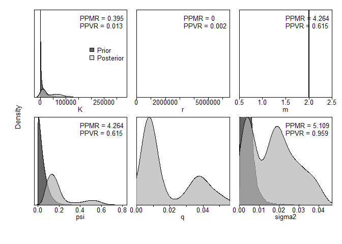
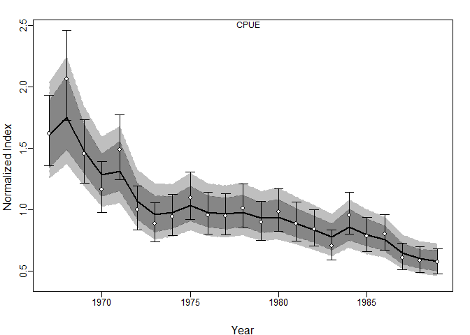
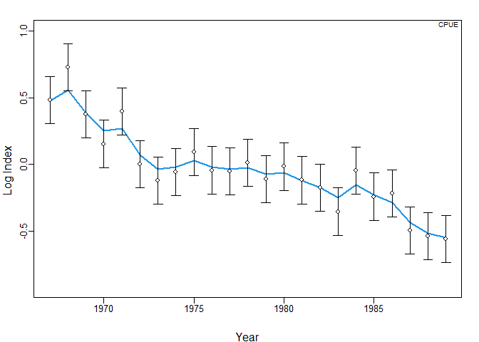
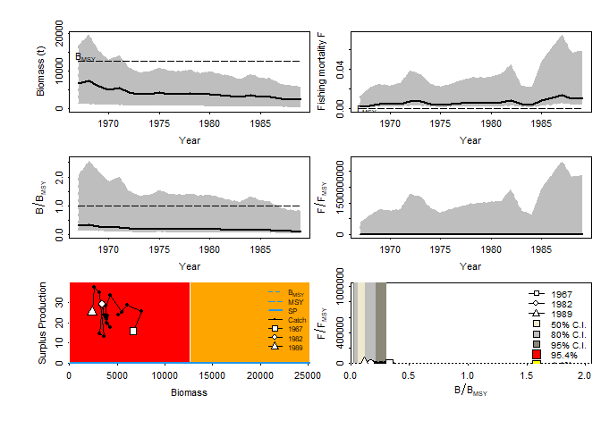
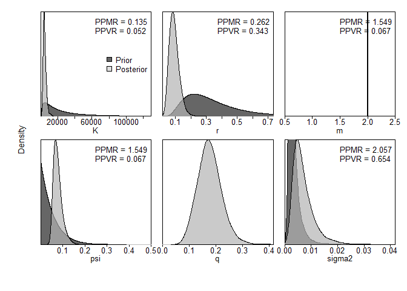
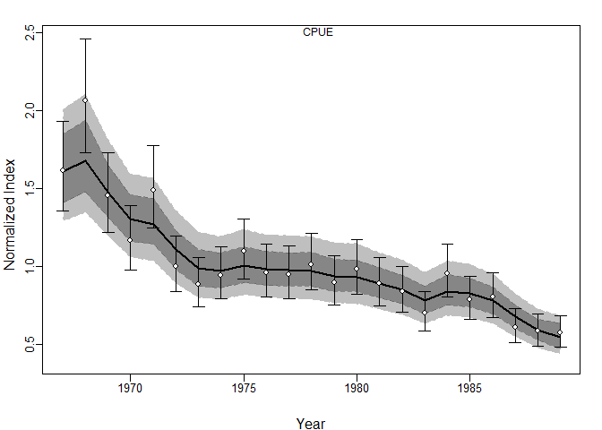
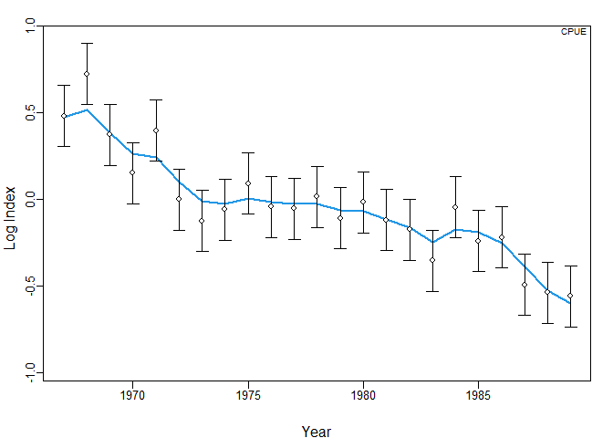
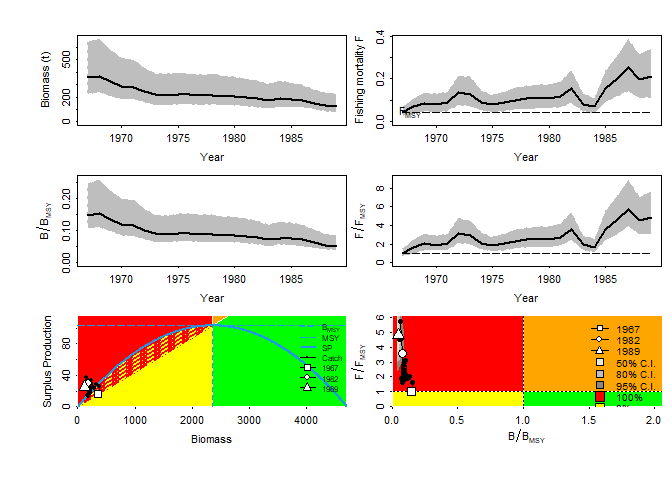

Example 1. Albacore
===================

とりあえず解析
--------------

### データの整理

    dat_albacore <- list(
      cpue = data.frame(Year = dat$albacore$timeI,
                        CPUE = dat$albacore$obsI),
      se = data.frame(Year = dat$albacore$timeI,
                      CPUE = rep(NA, length(dat$albacore$timeI))),
      catch = data.frame(Year = dat$albacore$timeC,
                         catch = dat$albacore$obsC)
      )

### 設定

    jbinput_albacore1 <-  build_jabba(
      catch = dat_albacore$catch,
      cpue = dat_albacore$cpue,
      se = dat_albacore$se,
      assessment="test_albacore",
      scenario = "TestRun",
      model.type = "Schaefer",
      add.catch.CV = FALSE,
      # prior sets
      r.dist = "lnorm",
      r.prior = c(0.5,10),
      K.dist = "lnorm",
      K.prior = c(10000, 10),
      psi.dist = "beta",
      psi.prior = c(0.05,0.9),
      # variance sets
      sigma.est = FALSE, # additional observation variance
      fixed.obsE = 0.)

    ## 
    ##  ><> Prepare JABBA input data <>< 
    ##  
    ## 
    ##  ><> Assume Catch to be known without error <>< 
    ##  
    ## 
    ##  ><> Model type: Schaefer  <>< 
    ## 
    ##  ><> Shape m = 2 
    ## 
    ##  ><> K prior mean = 10000 and CV = 10 (log.sd =  2.148283 ) 
    ## 
    ##  ><> r prior mean = 0.5 and CV = 5.184706e+21 (log.sd =  10 ) 
    ## 
    ##  ><> Psi (B1/K) prior mean = 0.05 and CV = 0.9 with beta destribution 
    ## 
    ##  
    ##  
    ##  ><> ALWAYS ENSURE to adjust default settings to your specific stock <>< 
    ## 

### MCMCの実行

    fit_albacore1 <- fit_jabba(jbinput_albacore1, quickmcmc=TRUE)

    ## module glm loaded

    ## Compiling model graph
    ##    Resolving undeclared variables
    ##    Allocating nodes
    ## Graph information:
    ##    Observed stochastic nodes: 72
    ##    Unobserved stochastic nodes: 52
    ##    Total graph size: 1229
    ## 
    ## Initializing model
    ## 
    ## 
    ## ><> Produce results output of Schaefer model for test_albacore TestRun <><
    ## 
    ## 
    ## ><> Scenario TestRun_Schaefer completed in 0 min and 28 sec <><

    fit_albacore1$estimates

    ##                          mu                    lci                 uci
    ## K          25278.9735069969 5803.38603952015910181     115864.45393883
    ## r              0.0000368891    0.00000000002021244          0.02591418
    ## psi            0.1575754861    0.06571992738116969          0.58709765
    ## sigma.proc     0.1330000000    0.04400000000000000          0.19900000
    ## m              2.0000000000    2.00000000000000000          2.00000000
    ## Hmsy           0.0000000000    0.00000000000000000          0.01300000
    ## SBmsy      12639.4870000000 2901.69300000000021100      57932.22700000
    ## MSY            0.2170000000    0.00000000000000000        247.65400000
    ## bmsyk          0.5000000000    0.50000000000000000          0.50000000
    ## P1967          0.1630000000    0.06700000000000000          1.04300000
    ## P1989          0.0570000000    0.02400000000000000          0.42500000
    ## B_Bmsy.cur     0.1150000000    0.04800000000000000          0.85000000
    ## H_Hmsy.cur   843.3300000000    0.63600000000000001 1885565332.04699993

### 結果の出力

    jbplot_catcherror(fit_albacore1)

    ## 
    ## ><> jbplot_catcherror() only available if add.catch.CV=TRUE <><

    jbplot_ppdist(fit_albacore1)

    ## 
    ## ><> jbplot_ppist() - prior and posterior distributions  <><

    jbplot_cpuefits(fit_albacore1)

    ## 
    ## ><> jbplot_cpue() - fits to CPUE <><

    jbplot_logfits(fit_albacore1)

    ## 
    ## ><> jbplot_logfits()  <><

    par(mfrow=c(3,2),mar = c(3.5, 3.5, 0.5, 0.1))
    jbplot_trj(fit_albacore1,type="B",add=T)

    ## 
    ## ><> jbplot_trj() - B trajectory  <><

    jbplot_trj(fit_albacore1,type="F",add=T)

    ## 
    ## ><> jbplot_trj() - F trajectory  <><

    jbplot_trj(fit_albacore1,type="BBmsy",add=T)

    ## 
    ## ><> jbplot_trj() - BBmsy trajectory  <><

    jbplot_trj(fit_albacore1,type="FFmsy",add=T)

    ## 
    ## ><> jbplot_trj() - FFmsy trajectory  <><

    jbplot_spphase(fit_albacore1,add=T)

    ## 
    ## ><> jbplot_spphase() - JABBA Surplus Production Phase Plot  <><

    jbplot_kobe(fit_albacore1,add=T)

    ## 
    ## ><> jbplot_kobe() - Stock Status Plot  <><

    ## Warning in bkfe(gcounts, 6L, alpha, range.x = c(sa, sb), binned = TRUE): Binning
    ## grid too coarse for current (small) bandwidth: consider increasing 'gridsize'

    ## Warning in bkfe(gcounts, 4L, alpha, range.x = c(sa, sb), binned = TRUE): Binning
    ## grid too coarse for current (small) bandwidth: consider increasing 'gridsize'

    ## Warning in bkde2D(x, bandwidth = bandwidth * factor, gridsize = nbins, ...):
    ## Binning grid too coarse for current (small) bandwidth: consider increasing
    ## 'gridsize'

事前分布を無情報にしてみる
--------------------------

    jbinput_albacore2 <-  build_jabba(
      catch = dat_albacore$catch,
      cpue = dat_albacore$cpue,
      se = dat_albacore$se,
      assessment="test_albacore",
      scenario = "TestRun",
      model.type = "Schaefer",
      add.catch.CV = FALSE,
      # prior sets
      r.dist = "range",
      r.prior = c(0.1,0.9),
      K.dist = "range",
      K.prior = c(1000, 100000),
      psi.dist = "beta",
      psi.prior = c(0.05,0.95),
      # variance sets
      sigma.est = FALSE, # additional observation variance
      fixed.obsE = 0.)

    ## 
    ##  ><> Prepare JABBA input data <>< 
    ##  
    ## 
    ##  ><> Assume Catch to be known without error <>< 
    ##  
    ## 
    ##  ><> Model type: Schaefer  <>< 
    ## 
    ##  ><> Shape m = 2 
    ## 
    ##  ><> K prior mean = 19400.96 and CV = 1.662519 (log.sd =  1.151293 ) 
    ## 
    ##  ><> r prior mean = 0.3 and CV = 0.5934694 (log.sd =  0.5493061 ) 
    ## 
    ##  ><> Psi (B1/K) prior mean = 0.05 and CV = 0.95 with beta destribution 
    ## 
    ##  
    ##  
    ##  ><> ALWAYS ENSURE to adjust default settings to your specific stock <>< 
    ## 

### MCMCの実行

    fit_albacore2 <- fit_jabba(jbinput_albacore2)

    ## Compiling model graph
    ##    Resolving undeclared variables
    ##    Allocating nodes
    ## Graph information:
    ##    Observed stochastic nodes: 72
    ##    Unobserved stochastic nodes: 52
    ##    Total graph size: 1230
    ## 
    ## Initializing model
    ## 
    ## 
    ## ><> Produce results output of Schaefer model for test_albacore TestRun <><
    ## 
    ## 
    ## ><> Scenario TestRun_Schaefer completed in 0 min and 37 sec <><

    fit_albacore2$estimates

    ##                       mu           lci          uci
    ## K          4717.06250829 2490.51516228 9487.2923277
    ## r             0.08732201    0.04193340    0.1615686
    ## psi           0.07366230    0.05046505    0.1250243
    ## sigma.proc    0.07700000    0.04800000    0.1320000
    ## m             2.00000000    2.00000000    2.0000000
    ## Hmsy          0.04400000    0.02100000    0.0810000
    ## SBmsy      2358.53100000 1245.25800000 4743.6460000
    ## MSY         103.98900000   56.60700000  178.2620000
    ## bmsyk         0.50000000    0.50000000    0.5000000
    ## P1967         0.07400000    0.05200000    0.1240000
    ## P1989         0.02500000    0.01900000    0.0420000
    ## B_Bmsy.cur    0.04900000    0.03900000    0.0830000
    ## H_Hmsy.cur    4.80500000    3.02500000    7.5850000

### 結果の出力

    jbplot_ppdist(fit_albacore2)

    ## 
    ## ><> jbplot_ppist() - prior and posterior distributions  <><

    jbplot_cpuefits(fit_albacore2)

    ## 
    ## ><> jbplot_cpue() - fits to CPUE <><

    jbplot_logfits(fit_albacore2)

    ## 
    ## ><> jbplot_logfits()  <><

    par(mfrow=c(3,2),mar = c(3.5, 3.5, 0.5, 0.1))
    jbplot_trj(fit_albacore2,type="B",add=T)

    ## 
    ## ><> jbplot_trj() - B trajectory  <><

    jbplot_trj(fit_albacore2,type="F",add=T)

    ## 
    ## ><> jbplot_trj() - F trajectory  <><

    jbplot_trj(fit_albacore2,type="BBmsy",add=T)

    ## 
    ## ><> jbplot_trj() - BBmsy trajectory  <><

    jbplot_trj(fit_albacore2,type="FFmsy",add=T)

    ## 
    ## ><> jbplot_trj() - FFmsy trajectory  <><

    jbplot_spphase(fit_albacore2,add=T)

    ## 
    ## ><> jbplot_spphase() - JABBA Surplus Production Phase Plot  <><

    jbplot_kobe(fit_albacore2,add=T)

    ## 
    ## ><> jbplot_kobe() - Stock Status Plot  <><

