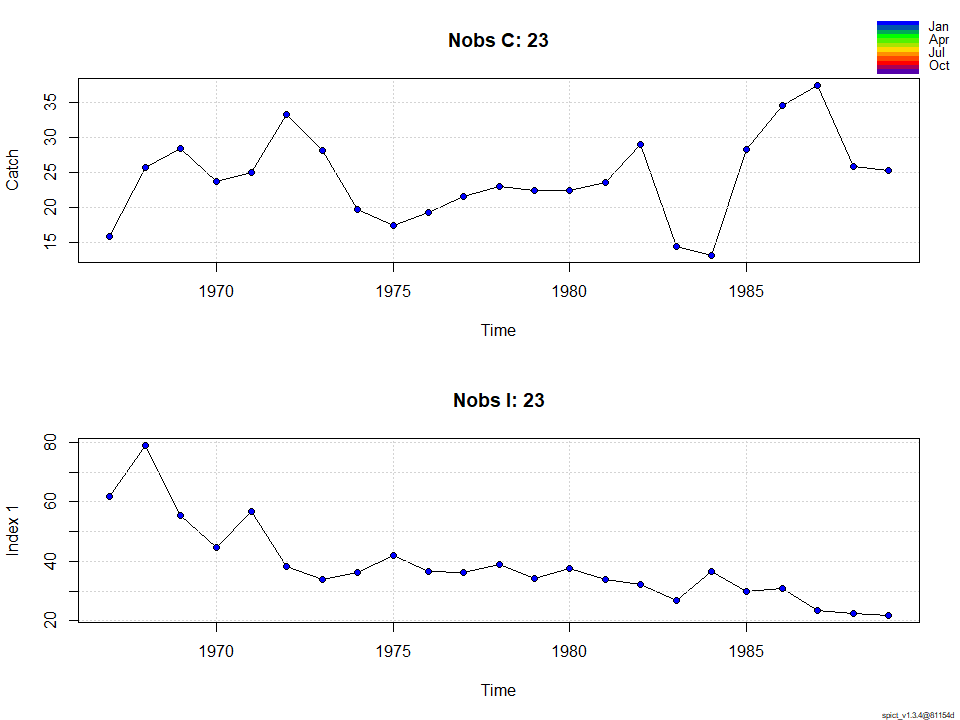
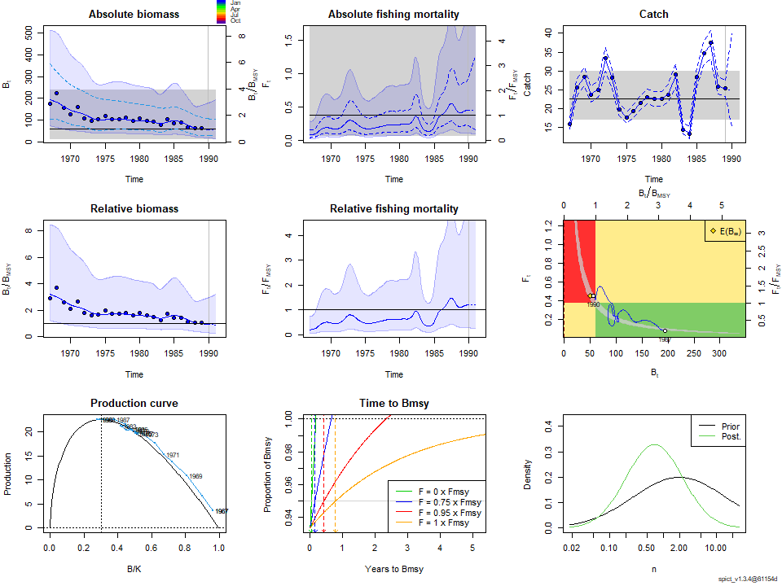
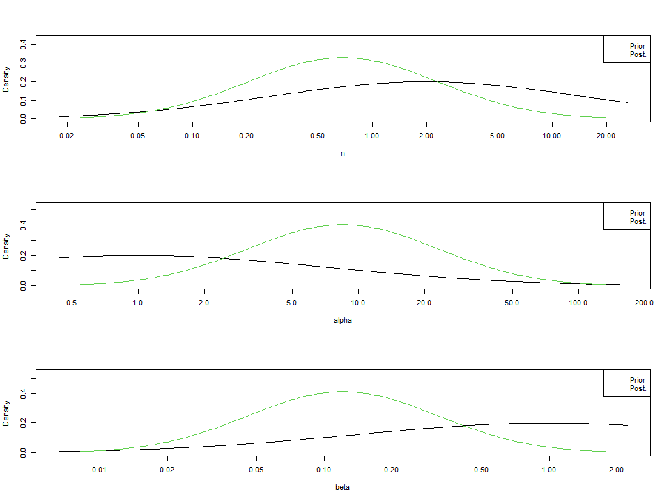
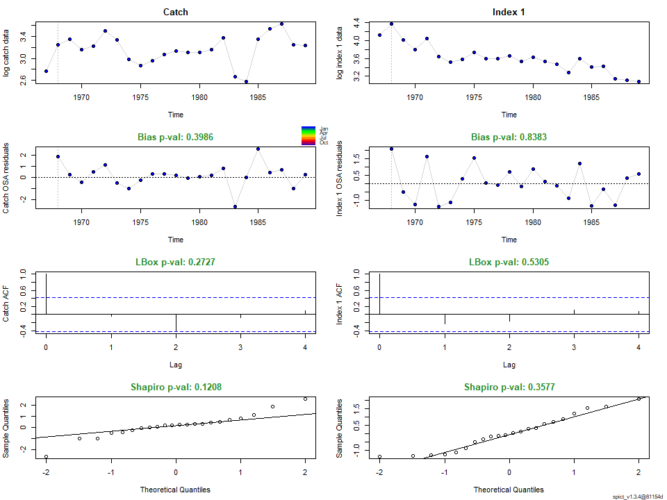
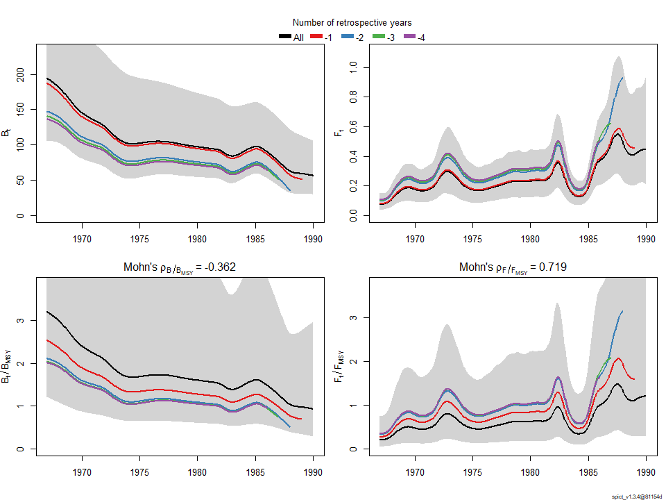
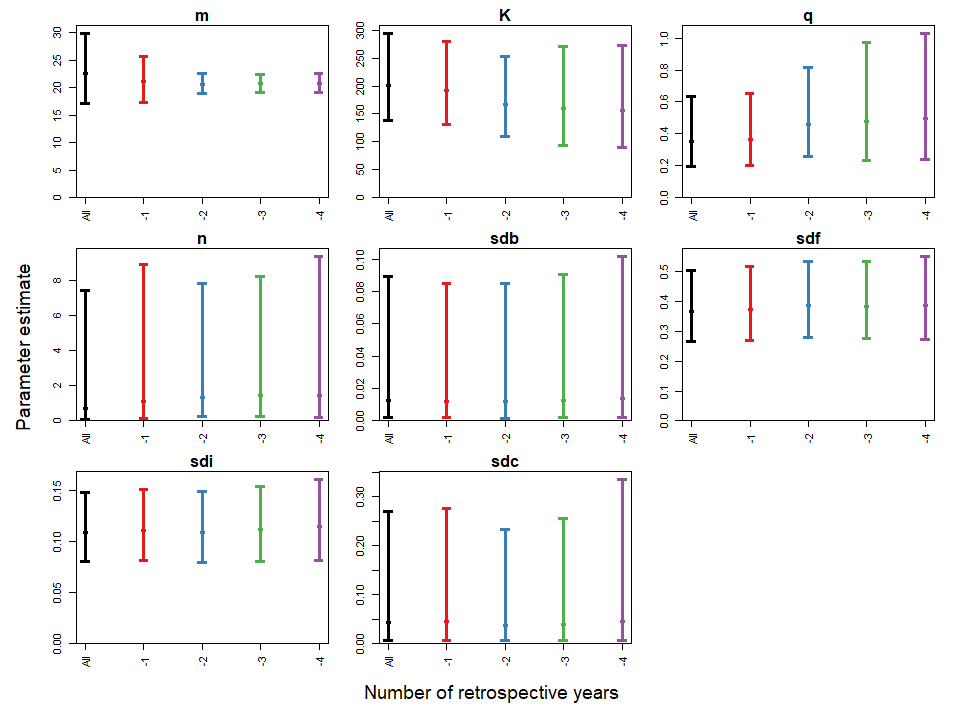

-   [1．準備](#準備)
-   [2. Albacoreの解析](#albacoreの解析)

1．準備
-------

``` r
devtools::install_github("DTUAqua/spict/spict") #パッケージのインストール
```

    Error in get(genname, envir = envir) : 
       オブジェクト 'testthat_print' がありません 

``` r
library(spict)#ライブラリーの読み込み  

#1-1　例データの読み込み  

data(pol)
pol$albacore #data of south atlantic albacore　データの単位はCが1000t, CPUEはkg/100hooks  
```

    $obsC
     [1] 15.9 25.7 28.5 23.7 25.0 33.3 28.2 19.7 17.5 19.3 21.6 23.1 22.5 22.5 23.6
    [16] 29.1 14.4 13.2 28.4 34.6 37.5 25.9 25.3

    $timeC
     [1] 1967 1968 1969 1970 1971 1972 1973 1974 1975 1976 1977 1978 1979 1980 1981
    [16] 1982 1983 1984 1985 1986 1987 1988 1989

    $obsI
     [1] 61.89 78.98 55.59 44.61 56.89 38.27 33.84 36.13 41.95 36.63 36.33 38.82
    [13] 34.32 37.64 34.01 32.16 26.88 36.61 30.07 30.75 23.36 22.36 21.91

    $timeI
     [1] 1967 1968 1969 1970 1971 1972 1973 1974 1975 1976 1977 1978 1979 1980 1981
    [16] 1982 1983 1984 1985 1986 1987 1988 1989

``` r
pol$lobster #data on new zealand rock lobster データの単位はCがt  
```

    $obsC
     [1]  809  854  919 1360 1872 2672 2834 3324 4160 5541 5009 6547 5049 4447 4018
    [16] 3762 4042 4583 4554 4597 4984 5295 4782 4975 4786 4699 4478 3495 3784 3643
    [31] 2987 3311 3237 3418 4050 4190 4058 4331 4385 4911 4856 4657 4500 3128 3318
    [46] 2770

    $timeC
     [1] 1945 1946 1947 1948 1949 1950 1951 1952 1953 1954 1955 1956 1957 1958 1959
    [16] 1960 1961 1962 1963 1964 1965 1966 1967 1968 1969 1970 1971 1972 1973 1974
    [31] 1975 1976 1977 1978 1979 1980 1981 1982 1983 1984 1985 1986 1987 1988 1989
    [46] 1990

    $obsI
     [1] 3.49 3.38 3.18 3.56 1.79 4.35 2.33 2.57 2.88 3.85 4.16 4.34 3.70 2.37 2.46
    [16] 2.06 2.21 2.19 2.44 2.14 2.18 2.13 1.86 1.53 1.32 1.45 1.40 1.09 1.23 1.12
    [31] 0.92 1.02 1.00 1.05 1.09 1.03 1.01 0.98 0.88 0.85 0.84 0.81 0.84 0.68 0.62
    [46] 0.54

    $timeI
     [1] 1945 1946 1947 1948 1949 1950 1951 1952 1953 1954 1955 1956 1957 1958 1959
    [16] 1960 1961 1962 1963 1964 1965 1966 1967 1968 1969 1970 1971 1972 1973 1974
    [31] 1975 1976 1977 1978 1979 1980 1981 1982 1983 1984 1985 1986 1987 1988 1989
    [46] 1990

``` r
pol$hake #data on nothern namibian hake　データの単位はCが1000t  
```

    $obsC
     [1]  93.510 212.444 195.032 382.712 320.430 402.467 365.557 606.084 377.642
    [10] 318.836 309.374 389.020 276.901 254.251 170.006  97.181  90.523 176.532
    [19] 214.181 228.672 212.177 231.179 136.942 212.000

    $timeC
     [1] 1965 1966 1967 1968 1969 1970 1971 1972 1973 1974 1975 1976 1977 1978 1979
    [16] 1980 1981 1982 1983 1984 1985 1986 1987 1988

    $obsI
     [1] 1.78 1.31 0.91 0.96 0.88 0.90 0.87 0.72 0.57 0.45 0.42 0.42 0.49 0.43 0.40
    [16] 0.45 0.55 0.53 0.58 0.64 0.66 0.65 0.61 0.63

    $timeI
     [1] 1965 1966 1967 1968 1969 1970 1971 1972 1973 1974 1975 1976 1977 1978 1979
    [16] 1980 1981 1982 1983 1984 1985 1986 1987 1988

2. Albacoreの解析
-----------------

``` r
#2-1.　例データのプロット  
plotspict.data(pol$albacore)
```



``` r
# 2-2.　time intervalの指定/確認  
inp<-check.inp(pol$albacore)
inp$dtc
```

     [1] 1 1 1 1 1 1 1 1 1 1 1 1 1 1 1 1 1 1 1 1 1 1 1

``` r
# 2-3.　model fit  
res_albacore<-fit.spict(pol$albacore)

# summary of result
summary(res_albacore)
```

    Convergence: 0  MSG: relative convergence (4)
    Objective function at optimum: 2.0654937
    Euler time step (years):  1/16 or 0.0625
    Nobs C: 23,  Nobs I1: 23

    Priors
         logn  ~  dnorm[log(2), 2^2]
     logalpha  ~  dnorm[log(1), 2^2]
      logbeta  ~  dnorm[log(1), 2^2]

    Model parameter estimates w 95% CI 
               estimate       cilow       ciupp    log.est  
     alpha    8.5381049   1.2233145  59.5915714  2.1445391  
     beta     0.1212590   0.0180695   0.8137344 -2.1098262  
     r        0.2556015   0.1010611   0.6464616 -1.3641355  
     rc       0.7435358   0.1445758   3.8239150 -0.2963384  
     rold     0.8180032   0.0019102 350.2949938 -0.2008891  
     m       22.5827677  17.0682738  29.8789089  3.1171871  
     K      201.4754010 138.1203391 293.8910914  5.3056673  
     q        0.3512548   0.1942710   0.6350919 -1.0462434  
     n        0.6875299   0.0636729   7.4238412 -0.3746500  
     sdb      0.0128136   0.0018407   0.0891983 -4.3572484  
     sdf      0.3673760   0.2673623   0.5048024 -1.0013694  
     sdi      0.1094038   0.0808977   0.1479547 -2.2127093  
     sdc      0.0445477   0.0073372   0.2704703 -3.1111956  
     
    Deterministic reference points (Drp)
             estimate      cilow      ciupp    log.est  
     Bmsyd 60.7442667 15.4035001 239.547240  4.1066727  
     Fmsyd  0.3717679  0.0722879   1.911957 -0.9894856  
     MSYd  22.5827677 17.0682738  29.878909  3.1171871  
    Stochastic reference points (Srp)
           estimate     cilow      ciupp    log.est  rel.diff.Drp  
     Bmsys 60.73662 15.403659 239.484437  4.1065468 -1.259605e-04  
     Fmsys  0.37178  0.072281   1.912265 -0.9894529  3.257870e-05  
     MSYs  22.58066 17.062739  29.883028  3.1170939 -9.324958e-05  

    States w 95% CI (inp$msytype: s)
                      estimate      cilow       ciupp    log.est  
     B_1989.94      56.6971159 30.1359483 106.6687174  4.0377233  
     F_1989.94       0.4464499  0.2145076   0.9291863 -0.8064282  
     B_1989.94/Bmsy  0.9334915  0.2961564   2.9423855 -0.0688234  
     F_1989.94/Fmsy  1.2008441  0.2864363   5.0343707  0.1830247  

    Predictions w 95% CI (inp$msytype: s)
                    prediction      cilow      ciupp    log.est  
     B_1991.00      54.3059314 27.8530542 105.881896  3.9946335  
     F_1991.00       0.4464501  0.1573061   1.267069 -0.8064276  
     B_1991.00/Bmsy  0.8941218  0.2498623   3.199578 -0.1119133  
     F_1991.00/Fmsy  1.2008447  0.2390672   6.031894  0.1830252  
     Catch_1990.00  24.7359915 15.3329650  39.905477  3.2082593  
     E(B_inf)       49.9856298         NA         NA  3.9117356  

``` r
# 2-4.　plot results
plot(res_albacore) #全体的な結果のプロット
```



``` r
plotspict.priors(res_albacore)#shape parameter(n)とalpha,betaの事前分布と事後分布
```



``` r
# 2-5.　Residuals and diagnostics 残差診断
res<-calc.osa.resid(res_albacore)
plotspict.diagnostic(res)
```



``` r
# 2-6.　Retrospective plots レトロ解析
res<-retro(res_albacore,nretroyear=4)
plotspict.retro(res)
```



         FFmsy      BBmsy 
     0.7187881 -0.3619983 

``` r
plotspict.retro.fixed(res)
```



``` r
mohns_rho(res,what=c("FFmsy","BBmsy")) #モーンズローの値
```

         FFmsy      BBmsy 
     0.7187881 -0.3619983
