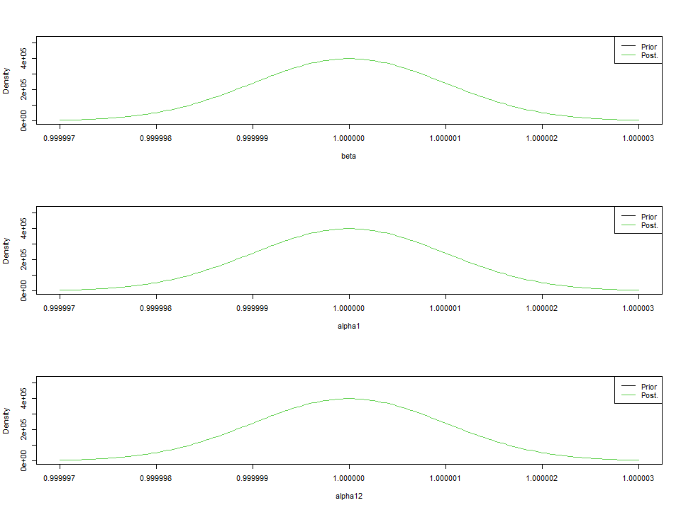
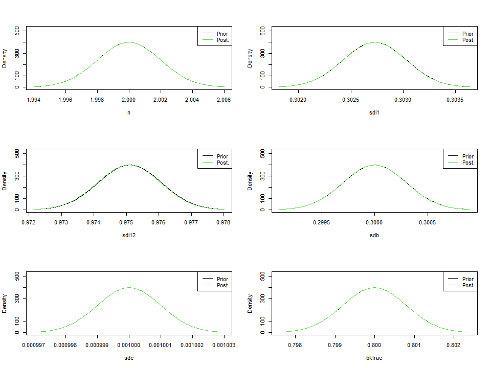

-   [1．準備](#準備)
-   [2．
    test\_data(ここではexample1.csv)の解析](#test_dataここではexample1.csvの解析)
-   [以下は季節性データを使用しない場合の例です　](#以下は季節性データを使用しない場合の例です)
    -   [2-1.
        シナリオ1：Schaefer型(n=2),BiomassとFの過程誤差あり・IndexとCatchのの観測誤差あり（注：自由に推定させるケース）](#シナリオ1schaefer型n2biomassとfの過程誤差ありindexとcatchのの観測誤差あり注自由に推定させるケース)
    -   [2-2. シナリオ2：nを推定させる,alpha=1,
        beta=1と制約を置く](#シナリオ2nを推定させるalpha1-beta1と制約を置く)
    -   [2-3.
        シナリオ3：Schaefer型(n=2),BiomassとFの過程誤差あり，Indexの観測誤差あり，Cの観測誤差なし](#シナリオ3schaefer型n2biomassとfの過程誤差ありindexの観測誤差ありcの観測誤差なし)
    -   [2-4.
        シナリオ4：Schaefer型(n=2),BiomassとFの過程誤差あり，Indexの観測誤差ほぼfixだけど狭いprior与える，Cの観測誤差推定](#シナリオ4schaefer型n2biomassとfの過程誤差ありindexの観測誤差ほぼfixだけど狭いprior与えるcの観測誤差推定)
    -   [2-5.
        シナリオ5：Schaefer型(n=2),BiomassとFの過程誤差あり，Indexの観測誤差ほぼfixだけど狭いprior与える，Cの観測誤差なし](#シナリオ5schaefer型n2biomassとfの過程誤差ありindexの観測誤差ほぼfixだけど狭いprior与えるcの観測誤差なし)
    -   [2-6.
        シナリオ6：Schaefer型(n=2),BiomassとFの過程誤差あり，Indexの観測誤差ほぼfixだけど狭いprior与える，Cの観測誤差なし,Initial
        statesもほぼ固定したら？](#シナリオ6schaefer型n2biomassとfの過程誤差ありindexの観測誤差ほぼfixだけど狭いprior与えるcの観測誤差なしinitial-statesもほぼ固定したら)
    -   [2-7.
        シナリオ7：Schaefer型(n=2),BiomassとFの過程誤差あり，Indexの観測誤差ほぼfixだけど狭いprior与える，Cの観測誤差なし,Initial
        statesもほぼ固定, Biomassのprocess
        errorもほぼ固定したら？](#シナリオ7schaefer型n2biomassとfの過程誤差ありindexの観測誤差ほぼfixだけど狭いprior与えるcの観測誤差なしinitial-statesもほぼ固定-biomassのprocess-errorもほぼ固定したら)

1．準備
-------

``` r
#詳しい説明はspict_guidelines.pdfやspict_handbook.pdfを参照してください

#devtools::install_github("DTUAqua/spict/spict") #パッケージのインストール

library(spict)#ライブラリーの読み込み  

#1-1　データの読み込み  
#-------------------------------------------------
#共通の例データ(example1.csv)をSPiCT用のデータ形式に変換するコード
library(dplyr)
library(tidyr)

data<-read.csv("example1.csv")

#
data_noCV<-data %>% select(-CV,-Weight,-Memo) #とりあえずCV,wight,memoの情報は取り除く
use_data<-spread(data_noCV,key=Fleet,value=Value)

get_C<- use_data %>% filter(Label=="Catch")
C_data <- get_C %>% select(Year,All)
colnames(C_data)<-c("timeC","obsC")

get_I<- use_data %>% filter(Label=="Index")
I_data <- get_I %>% select(Year,Longline,PurseSeine)
colnames(I_data)<-c("timeI1","obsI1","obsI2")

test_data<-cbind(C_data,I_data)
test_data<-as.list(test_data) #リスト形式に変換　

#各資源量指標値のCVの抽出
 LL<- data %>% select(Year,Fleet,CV) %>% filter(Fleet=="Longline")
 PS<- data %>% select(Year,Fleet,CV) %>% filter(Fleet=="PurseSeine")
 obsI1_CV<-LL$CV[[1]] #LonglineのCV
 obsI2_CV<-PS$CV[[1]] #PurseSeineのCV
 

#-------------------------------------------------

#Fitする資源量指標値が二つの場合----
test_data$obsI<-list()
test_data$obsI[[1]]<-test_data$obsI1
test_data$obsI[[2]]<-test_data$obsI2
test_data$timeI<-list()
test_data$timeI[[1]]<-test_data$timeI1
test_data$timeI[[2]]<-test_data$timeI1
```

2． test\_data(ここではexample1.csv)の解析
------------------------------------------

``` r
# 2-1.　Catchと資源量指標値データのプロット  

plotspict.data(test_data)
```

    Removing zero, negative, and NAs in  I  series  1  


``` r
# 2-2.　time intervalの指定/確認  
inp<-check.inp(test_data)
```

    Removing zero, negative, and NAs in  I  series  1  

``` r
inp$dtc #time-intervalの指定．特に指定しない場合は，データの最初の観察値を1とし，その次の観察値は1年後とみなされるのでtime-intervalは1となる.もし四半期のデータなら，inp$dtc<-0.25と指定する
```

     [1] 1 1 1 1 1 1 1 1 1 1 1 1 1 1 1 1 1 1 1 1 1 1 1 1 1 1 1 1 1 1 1

以下は季節性データを使用しない場合の例です　
============================================

2-1. シナリオ1：Schaefer型(n=2),BiomassとFの過程誤差あり・IndexとCatchのの観測誤差あり（注：自由に推定させるケース）
--------------------------------------------------------------------------------------------------------------------

``` r
 inp <- test_data

 #shape parameterを固定したい場合は下記で定める
 inp$priors$logn<-c(log(2),1e-3) #shape parameter=2 Schaefer型にshape parameterを固定
 
 #その他の過程誤差，観測誤差に関してはとりあえずデフォルトのゆるいpriorをあてて推定させてみる
 #(どんなゆるいpriorをあてているかはsummaryを実行したときのPriorsというところに出てくる)
 
 #実行するためのコマンド
 res_example1<-fit.spict(inp)
```

    Removing zero, negative, and NAs in  I  series  1  

``` r
 #結果を要約する
 summary(res_example1)
```

    Convergence: 0  MSG: relative convergence (4)
    Objective function at optimum: 15.4397606
    Euler time step (years):  1/16 or 0.0625
    Nobs C: 31,  Nobs I1: 13,  Nobs I2: 31

    Priors
         logn  ~  dnorm[log(2), 0.001^2] (fixed)
     logalpha  ~  dnorm[log(1), 2^2]
      logbeta  ~  dnorm[log(1), 2^2]

    Model parameter estimates w 95% CI 
               estimate       cilow        ciupp    log.est  
     alpha1   0.4586147   0.1722560    1.2210169 -0.7795448  
     alpha2   0.6457972   0.3256873    1.2805351 -0.4372697  
     beta     0.1961977   0.0373234    1.0313519 -1.6286326  
     r        0.6243972   0.3594973    1.0844917 -0.4709686  
     rc       0.6243952   0.3594982    1.0844824 -0.4709717  
     rold     0.6243933   0.3594966    1.0844806 -0.4709748  
     m      121.7986381  88.3204515  167.9668524  4.8023692  
     K      780.2653509 466.8628071 1304.0533718  6.6596341  
     q1       0.0106536   0.0062538    0.0181487 -4.5418617  
     q2       0.0101256   0.0059922    0.0171102 -4.5926845  
     n        2.0000061   1.9960900    2.0039299  0.6931502  
     sdb      0.2392777   0.1560432    0.3669099 -1.4301307  
     sdf      0.3432259   0.2440291    0.4827457 -1.0693665  
     sdi1     0.1097363   0.0495752    0.2429046 -2.2096755  
     sdi2     0.1545248   0.1011658    0.2360277 -1.8674004  
     sdc      0.0673401   0.0146887    0.3087194 -2.6979991  
     
    Deterministic reference points (Drp)
              estimate       cilow       ciupp   log.est  
     Bmsyd 390.1331367 233.4317867 652.0271574  5.966488  
     Fmsyd   0.3121976   0.1797491   0.5422412 -1.164119  
     MSYd  121.7986381  88.3204515 167.9668524  4.802369  
    Stochastic reference points (Srp)
              estimate       cilow       ciupp   log.est rel.diff.Drp  
     Bmsys 365.0174673 217.9766237 611.2478904  5.899945  -0.06880676  
     Fmsys   0.2983738   0.1701055   0.5233631 -1.209408  -0.04633055  
     MSYs  108.5644635  78.4520087 150.2350664  4.687344  -0.12190153  

    States w 95% CI (inp$msytype: s)
                       estimate       cilow        ciupp    log.est  
     B_2020.94      589.7039545 317.8627148 1094.0281377  6.3796206  
     F_2020.94        0.0406132   0.0203101    0.0812125 -3.2036616  
     B_2020.94/Bmsy   1.6155500   1.0561729    2.4711879  0.4796754  
     F_2020.94/Fmsy   0.1361152   0.0738002    0.2510476 -1.9942535  

    Predictions w 95% CI (inp$msytype: s)
                     prediction       cilow        ciupp   log.est  
     B_2022.00      632.4487333 331.1537747 1207.8720849  6.449599  
     F_2022.00        0.0406134   0.0152377    0.1082475 -3.203657  
     B_2022.00/Bmsy   1.7326533   1.0831698    2.7715761  0.549654  
     F_2022.00/Fmsy   0.1361158   0.0539768    0.3432495 -1.994249  
     Catch_2021.00   24.8876546  13.2209671   46.8494738  3.214372  
     E(B_inf)       652.3012054          NA           NA  6.480506  

``` r
 #ちなみに結果に表示されるr,rold,rcの中身は r = m⁄K nn⁄(n-1), rold = | m⁄K nn⁄(n-1)1⁄(n-1) |,rc = | m⁄K n1⁄(n-1) 2 |.必要なのはr
```

``` r
# plot results
plot(res_example1) #全体的な結果のプロット
```


``` r
plotspict.priors(res_example1)#shape parameter(n)とalpha,betaの事前分布と事後分布
```


2-2. シナリオ2：nを推定させる,alpha=1, beta=1と制約を置く
---------------------------------------------------------

``` r
 inp <- test_data

 inp$priors$logbeta<-c(log(1),0.001^2) #betaに関するパラメータをfix. beta=1に固定
 inp$priors$logalpha<-c(log(1),0.001^2) #alphaに関するパラメータをfix. alpha=1に固定
 
 #inp$priors$logalpha<-c(1,1,0) #alphaに関するpriorをなくす場合の設定
 #inp$priors$logbeta<-c(1,1,0)#betaに関するpriorをなくす場合の設定
 
 res_example2<-fit.spict(inp)
```

    Removing zero, negative, and NAs in  I  series  1  

``` r
# summary of result
 summary(res_example2)
```

    Convergence: 0  MSG: both X-convergence and relative convergence (5)
    Objective function at optimum: -17.2743758
    Euler time step (years):  1/16 or 0.0625
    Nobs C: 31,  Nobs I1: 13,  Nobs I2: 31

    Priors
      logbeta  ~  dnorm[log(1), 0^2] (fixed)
     logalpha  ~  dnorm[log(1), 0^2] (fixed)
         logn  ~  dnorm[log(2), 2^2]

    Model parameter estimates w 95% CI 
               estimate       cilow       ciupp    log.est  
     alpha1   1.0000000   0.9999980   1.0000020  0.0000000  
     alpha2   1.0000000   0.9999980   1.0000020  0.0000000  
     beta     1.0000000   0.9999980   1.0000020  0.0000000  
     r        2.9584595   1.9758669   4.4296922  1.0846687  
     rc       0.7738627   0.4977861   1.2030540 -0.2563608  
     rold     0.4451520   0.2825099   0.7014277 -0.8093396  
     m      165.3941840 128.4208643 213.0123968  5.1083316  
     K      580.5157999 366.6983777 919.0075943  6.3639170  
     q1       0.0121307   0.0074843   0.0196619 -4.4120131  
     q2       0.0117949   0.0073402   0.0189529 -4.4400922  
     n        7.6459542   6.2265495   9.3889265  2.0341766  
     sdb      0.1796811   0.1430473   0.2256967 -1.7165716  
     sdf      0.2302230   0.1760046   0.3011434 -1.4687070  
     sdi1     0.1796811   0.1430473   0.2256967 -1.7165716  
     sdi2     0.1796811   0.1430473   0.2256967 -1.7165716  
     sdc      0.2302230   0.1760046   0.3011434 -1.4687070  
     
    Deterministic reference points (Drp)
              estimate      cilow      ciupp   log.est  
     Bmsyd 427.4509641 265.652180 687.795323  6.057840  
     Fmsyd   0.3869314   0.248893   0.601527 -0.949508  
     MSYd  165.3941840 128.420864 213.012397  5.108332  
    Stochastic reference points (Srp)
              estimate       cilow       ciupp   log.est rel.diff.Drp  
     Bmsys 398.7712267 247.7756327 641.7842202  5.988388  -0.07192028  
     Fmsys   0.3363762   0.1992541   0.5678624 -1.089525  -0.15029352  
     MSYs  132.6872353 100.0342717 175.9987065  4.887995  -0.24649657  

    States w 95% CI (inp$msytype: s)
                       estimate       cilow       ciupp    log.est  
     B_2020.94      557.9470421 344.1437942 904.5779904  6.3242641  
     F_2020.94        0.0522347   0.0274131   0.0995311 -2.9520090  
     B_2020.94/Bmsy   1.3991657   1.1648773   1.6805760  0.3358762  
     F_2020.94/Fmsy   0.1552864   0.0886467   0.2720225 -1.8624838  

    Predictions w 95% CI (inp$msytype: s)
                     prediction       cilow       ciupp    log.est  
     B_2022.00      565.6481392 347.2509817 921.4021967  6.3379722  
     F_2022.00        0.0522348   0.0235887   0.1156690 -2.9520057  
     B_2022.00/Bmsy   1.4184778   1.1952450   1.6834033  0.3495843  
     F_2022.00/Fmsy   0.1552870   0.0749514   0.3217291 -1.8624806  
     Catch_2021.00   29.4326419  17.1032821  50.6499516  3.3821043  
     E(B_inf)       536.4765392          NA          NA  6.2850228  

``` r
# plot results
plot(res_example2) #全体的な結果のプロット
```


``` r
plotspict.priors(res_example2)#shape parameter(n)とalpha,betaの事前分布と事後分布
```



2-3. シナリオ3：Schaefer型(n=2),BiomassとFの過程誤差あり，Indexの観測誤差あり，Cの観測誤差なし
----------------------------------------------------------------------------------------------

``` r
 inp <- test_data
 inp$priors$logn<-c(log(2),1e-3) #shape parameter=2 Schaefer型にshape parameterを固定
 

 inp$priors$logsdc<-c(log(0.001),1e-3)#漁獲量に関する観察誤差をほぼなしと仮定するための設定
 inp$priors$logbeta<-c(1,1,0)#betaに関するpriorはなくしておく
 
 res_example3<-fit.spict(inp)
```

    Removing zero, negative, and NAs in  I  series  1  

``` r
# summary of result
summary(res_example3)
```

    Convergence: 0  MSG: both X-convergence and relative convergence (5)
    Objective function at optimum: 10.7582718
    Euler time step (years):  1/16 or 0.0625
    Nobs C: 31,  Nobs I1: 13,  Nobs I2: 31

    Priors
         logn  ~  dnorm[log(2), 0.001^2] (fixed)
       logsdc  ~  dnorm[log(0.001), 0.001^2] (fixed)
     logalpha  ~  dnorm[log(1), 2^2]

    Model parameter estimates w 95% CI 
               estimate       cilow        ciupp    log.est  
     alpha1   0.4496023   0.1700443    1.1887621 -0.7993918  
     alpha2   0.6309585   0.3206053    1.2417408 -0.4605151  
     beta     0.0027566   0.0020229    0.0037562 -5.8937741  
     r        0.6306218   0.3635414    1.0939164 -0.4610489  
     rc       0.6306199   0.3635423    1.0939070 -0.4610520  
     rold     0.6306180   0.3635407    1.0939052 -0.4610550  
     m      122.5580851  88.8725780  169.0114607  4.8085851  
     K      777.3807311 466.4614452 1295.5428736  6.6559302  
     q1       0.0106780   0.0062908    0.0181248 -4.5395726  
     q2       0.0101476   0.0060249    0.0170915 -4.5905165  
     n        2.0000061   1.9960900    2.0039299  0.6931502  
     sdb      0.2429092   0.1591694    0.3707047 -1.4150677  
     sdf      0.3627719   0.2662287    0.4943247 -1.0139811  
     sdi1     0.1092125   0.0491973    0.2424396 -2.2144596  
     sdi2     0.1532656   0.1001834    0.2344735 -1.8755828  
     sdc      0.0010000   0.0009980    0.0010020 -6.9077552  
     
    Deterministic reference points (Drp)
            estimate       cilow       ciupp   log.est  
     Bmsyd 388.69082 233.2311030 647.7719100  5.962784  
     Fmsyd   0.31531   0.1817712   0.5469535 -1.154199  
     MSYd  122.55809  88.8725780 169.0114607  4.808585  
    Stochastic reference points (Srp)
              estimate       cilow       ciupp   log.est rel.diff.Drp  
     Bmsys 363.0628187 217.3680721 606.4120137  5.894576  -0.07058835  
     Fmsys   0.3010754   0.1718199   0.5275662 -1.200395  -0.04727903  
     MSYs  108.9444718  78.6971751 150.8173312  4.690838  -0.12495919  

    States w 95% CI (inp$msytype: s)
                       estimate       cilow        ciupp    log.est  
     B_2020.94      588.5357634 317.1383840 1092.1867623  6.3776377  
     F_2020.94        0.0398662   0.0200598    0.0792287 -3.2222272  
     B_2020.94/Bmsy   1.6210301   1.0565252    2.4871519  0.4830618  
     F_2020.94/Fmsy   0.1324126   0.0723964    0.2421817 -2.0218325  

    Predictions w 95% CI (inp$msytype: s)
                     prediction       cilow        ciupp    log.est  
     B_2022.00      631.3796877 330.1560996 1207.4297900  6.4479074  
     F_2022.00        0.0398663   0.0146014    0.1088474 -3.2222230  
     B_2022.00/Bmsy   1.7390370   1.0827987    2.7929935  0.5533315  
     F_2022.00/Fmsy   0.1324131   0.0512319    0.3422332 -2.0218283  
     Catch_2021.00   24.3863347  12.8730319   46.1968342  3.1940229  
     E(B_inf)       649.7374508          NA           NA  6.4765684  

``` r
# plot results
plot(res_example3) #全体的な結果のプロット
```


``` r
plotspict.priors(res_example3)#shape parameter(n)とalpha,betaの事前分布と事後分布
```


2-4. シナリオ4：Schaefer型(n=2),BiomassとFの過程誤差あり，Indexの観測誤差ほぼfixだけど狭いprior与える，Cの観測誤差推定
----------------------------------------------------------------------------------------------------------------------

``` r
 inp <- test_data
 inp$priors$logn<-c(log(2),1e-3) #shape parameter=2 Schaefer型にshape parameterを固定
 
#資源量指標値のCVが既知なのでlogsdiに狭いprior与える

 sd_obsI1<-mean(inp$obsI[[1]],na.rm=TRUE)*obsI1_CV #固定したい資源量指標値の平均値(この場合はobsI[[1]]の例)*obsI1のCVの値
 sd_obsI2<-mean(inp$obsI[[2]],na.rm=TRUE)*obsI2_CV #固定したい資源量指標値の平均値(この場合はobsI[[2]]の例)*obsI2のCVの値
 
 inp$priors$logsdi<-list(c(log(sd_obsI1),1e-3,1),c(log(sd_obsI2),1e-3,1))#logsdi1とlogsdi2に狭い事前分布を与えて推定させる
 inp$priors$logalpha<-c(1,1,0)#alphaに関するpriorはなくしておく
 
 res_example5<-fit.spict(inp)
```

    Removing zero, negative, and NAs in  I  series  1  

``` r
# summary of result
summary(res_example5)
```

    Convergence: 0  MSG: relative convergence (4)
    Objective function at optimum: 38.0387828
    Euler time step (years):  1/16 or 0.0625
    Nobs C: 31,  Nobs I1: 13,  Nobs I2: 31

    Priors
        logn  ~  dnorm[log(2), 0.001^2] (fixed)
     logbeta  ~  dnorm[log(1), 2^2]
     logsdi1  ~  dnorm[log(0.303), 0.001^2] (fixed)
     logsdi2  ~  dnorm[log(0.975), 0.001^2] (fixed)

    Model parameter estimates w 95% CI 
                estimate       cilow        ciupp    log.est  
     alpha1   56.3298806   0.3583141 8.855513e+03  4.0312251  
     alpha2  181.4385997   1.1541306 2.852360e+04  5.2009173  
     beta      0.1129334   0.0032632 3.908392e+00 -2.1809569  
     r         0.4577558   0.3356266 6.243257e-01 -0.7814195  
     rc        0.4577549   0.3356292 6.243187e-01 -0.7814213  
     rold      0.4577541   0.3356276 6.243195e-01 -0.7814231  
     m       124.5979580 110.0475054 1.410723e+02  4.8250922  
     K      1088.7735945 896.4031423 1.322427e+03  6.9928072  
     q1        0.0098491   0.0061560 1.575790e-02 -4.6203723  
     q2        0.0086159   0.0053862 1.378220e-02 -4.7541490  
     n         2.0000036   1.9960875 2.003927e+00  0.6931490  
     sdb       0.0053742   0.0000342 8.448630e-01 -5.2261510  
     sdf       0.4172271   0.2993633 5.814957e-01 -0.8741246  
     sdi1      0.3027264   0.3021336 3.033203e-01 -1.1949259  
     sdi2      0.9750820   0.9731727 9.769950e-01 -0.0252337  
     sdc       0.0471189   0.0016764 1.324340e+00 -3.0550815  
     
    Deterministic reference points (Drp)
              estimate       cilow       ciupp   log.est  
     Bmsyd 544.3871721 448.2024894 661.2131796  6.299661  
     Fmsyd   0.2288775   0.1678146   0.3121594 -1.474568  
     MSYd  124.5979580 110.0475054 141.0722677  4.825092  
    Stochastic reference points (Srp)
              estimate      cilow       ciupp   log.est  rel.diff.Drp  
     Bmsys 544.3652728 448.223035 661.1296770  6.299620 -4.022903e-05  
     Fmsys   0.2288704   0.167798   0.3121708 -1.474600 -3.088568e-05  
     MSYs  124.5890807 110.024648 141.0814701  4.825021 -7.125267e-05  

    States w 95% CI (inp$msytype: s)
                       estimate       cilow       ciupp    log.est  
     B_2020.94      749.7676924 596.0874845 943.0689407  6.6197634  
     F_2020.94        0.0318677   0.0191908   0.0529186 -3.4461627  
     B_2020.94/Bmsy   1.3773246   1.0456903   1.8141347  0.3201429  
     F_2020.94/Fmsy   0.1392390   0.0766235   0.2530229 -1.9715632  

    Predictions w 95% CI (inp$msytype: s)
                      prediction       cilow       ciupp    log.est  
     B_2022.00       828.7892580 695.0987837 988.1928300  6.7199659  
     F_2022.00         0.0318679   0.0119159   0.0852275 -3.4461575  
     B_2022.00/Bmsy    1.5224874   1.2194604   1.9008144  0.4203454  
     F_2022.00/Fmsy    0.1392397   0.0495566   0.3912233 -1.9715580  
     Catch_2021.00    25.2092479  13.0207823  48.8070657  3.2272109  
     E(B_inf)       1012.9047421          NA          NA  6.9205775  

``` r
# plot results
plot(res_example5) #全体的な結果のプロット
```


``` r
plotspict.priors(res_example5)#shape parameter(n)とalpha,betaの事前分布と事後分布
```


2-5. シナリオ5：Schaefer型(n=2),BiomassとFの過程誤差あり，Indexの観測誤差ほぼfixだけど狭いprior与える，Cの観測誤差なし
----------------------------------------------------------------------------------------------------------------------

``` r
 inp <- test_data
 inp$priors$logn<-c(log(2),1e-3) #shape parameter=2 Schaefer型にshape parameterを固定
 
#資源量指標値のCVが既知なのでlogsdiに狭いprior与える

 sd_obsI1<-mean(inp$obsI[[1]],na.rm=TRUE)*obsI1_CV #固定したい資源量指標値の平均値(この場合はobsI[[1]]の例)*obsI1のCVの値
 sd_obsI2<-mean(inp$obsI[[2]],na.rm=TRUE)*obsI2_CV #固定したい資源量指標値の平均値(この場合はobsI[[2]]の例)*obsI2のCVの値
 
 inp$priors$logsdi<-list(c(log(sd_obsI1),1e-3,1),c(log(sd_obsI2),1e-3,1))#logsdi1とlogsdi2に狭い事前分布を与えて推定させる
 inp$priors$logalpha<-c(1,1,0)#alphaに関するpriorはなくしておく
 
 inp$priors$logsdc<-c(log(0.001),1e-3)#漁獲量に関する観察誤差をほぼなしと仮定するための設定
 inp$priors$logbeta<-c(1,1,0)#betaに関するpriorはなくしておく
 
 res_example6<-fit.spict(inp)
```

    Removing zero, negative, and NAs in  I  series  1  

``` r
# summary of result
summary(res_example6)
```

    Convergence: 0  MSG: relative convergence (4)
    Objective function at optimum: 32.3153942
    Euler time step (years):  1/16 or 0.0625
    Nobs C: 31,  Nobs I1: 13,  Nobs I2: 31

    Priors
        logn  ~  dnorm[log(2), 0.001^2] (fixed)
      logsdc  ~  dnorm[log(0.001), 0.001^2] (fixed)
     logsdi1  ~  dnorm[log(0.303), 0.001^2] (fixed)
     logsdi2  ~  dnorm[log(0.975), 0.001^2] (fixed)

    Model parameter estimates w 95% CI 
                estimate       cilow        ciupp    log.est  
     alpha1  243.3448807   2.8758407 2.059110e+04  5.4944797  
     alpha2  783.8138129   9.2630829 6.632393e+04  6.6641715  
     beta      0.0022911   0.0017759 2.955900e-03 -6.0787070  
     r         0.4973606   0.3661065 6.756710e-01 -0.6984399  
     rc        0.4973580   0.3661085 6.756604e-01 -0.6984452  
     rold      0.4973554   0.3661059 6.756581e-01 -0.6984504  
     m       128.3408696 113.7101757 1.448540e+02  4.8546898  
     K      1032.1788985 857.1758275 1.242911e+03  6.9394273  
     q1        0.0105310   0.0066147 1.676580e-02 -4.5534356  
     q2        0.0087775   0.0055581 1.386150e-02 -4.7355660  
     n         2.0000105   1.9960944 2.003934e+00  0.6931524  
     sdb       0.0012440   0.0000147 1.052653e-01 -6.6894056  
     sdf       0.4364645   0.3383103 5.630963e-01 -0.8290482  
     sdi1      0.3027264   0.3021336 3.033203e-01 -1.1949259  
     sdi2      0.9750816   0.9731723 9.769946e-01 -0.0252341  
     sdc       0.0010000   0.0009980 1.002000e-03 -6.9077552  
     
    Deterministic reference points (Drp)
             estimate       cilow       ciupp   log.est  
     Bmsyd 516.090493 428.5895514 621.4556481  6.246282  
     Fmsyd   0.248679   0.1830542   0.3378302 -1.391592  
     MSYd  128.340870 113.7101757 144.8540442  4.854690  
    Stochastic reference points (Srp)
              estimate       cilow       ciupp   log.est  rel.diff.Drp  
     Bmsys 516.0894463 428.5906417 621.4515453  6.246280 -2.028994e-06  
     Fmsys   0.2486786   0.1830533   0.3378308 -1.391594 -1.622555e-06  
     MSYs  128.3404136 113.7089184 144.8546164  4.854686 -3.553225e-06  

    States w 95% CI (inp$msytype: s)
                       estimate       cilow       ciupp    log.est  
     B_2020.94      742.6035464 605.6798928 910.4809879  6.6101623  
     F_2020.94        0.0317633   0.0194791   0.0517944 -3.4494432  
     B_2020.94/Bmsy   1.4389047   1.1195182   1.8494088  0.3638822  
     F_2020.94/Fmsy   0.1277284   0.0727451   0.2242700 -2.0578494  

    Predictions w 95% CI (inp$msytype: s)
                     prediction       cilow       ciupp    log.est  
     B_2022.00      817.0888428 701.8925480 951.1914308  6.7057478  
     F_2022.00        0.0317635   0.0115888   0.0870599 -3.4494380  
     B_2022.00/Bmsy   1.5832311   1.3038042   1.9225438  0.4594677  
     F_2022.00/Fmsy   0.1277290   0.0448694   0.3636044 -2.0578441  
     Catch_2021.00   24.8347350  12.6500716  48.7557763  3.2122433  
     E(B_inf)       966.2563998          NA          NA  6.8734292  

``` r
# plot results
plot(res_example6) #全体的な結果のプロット
```


``` r
plotspict.priors(res_example6)#shape parameter(n)とalpha,betaの事前分布と事後分布
```


2-6. シナリオ6：Schaefer型(n=2),BiomassとFの過程誤差あり，Indexの観測誤差ほぼfixだけど狭いprior与える，Cの観測誤差なし,Initial statesもほぼ固定したら？
-------------------------------------------------------------------------------------------------------------------------------------------------------

``` r
 inp <- test_data
 inp$priors$logn<-c(log(2),1e-3) #shape parameter=2 Schaefer型にshape parameterを固定
 
#資源量指標値のCVが既知なのでlogsdiに狭いprior与える

 sd_obsI1<-mean(inp$obsI[[1]],na.rm=TRUE)*obsI1_CV #固定したい資源量指標値の平均値(この場合はobsI[[1]]の例)*obsI1のCVの値
 sd_obsI2<-mean(inp$obsI[[2]],na.rm=TRUE)*obsI2_CV #固定したい資源量指標値の平均値(この場合はobsI[[2]]の例)*obsI2のCVの値
 
 inp$priors$logsdi<-list(c(log(sd_obsI1),1e-3,1),c(log(sd_obsI2),1e-3,1))#logsdi1とlogsdi2に狭い事前分布を与えて推定させる
 inp$priors$logalpha<-c(1,1,0)#alphaに関するpriorはなくしておく
 
 inp$priors$logsdc<-c(log(0.001),1e-3)#漁獲量に関する観察誤差をほぼなしと仮定するための設定
 inp$priors$logbeta<-c(1,1,0)#betaに関するpriorはなくしておく
 
 inp$priors$logbkfrac<-c(log(0.8),1e-3)
 
 res_example7<-fit.spict(inp)
```

    Removing zero, negative, and NAs in  I  series  1  

``` r
# summary of result
summary(res_example7)
```

    Convergence: 0  MSG: relative convergence (4)
    Objective function at optimum: 28.5021149
    Euler time step (years):  1/16 or 0.0625
    Nobs C: 31,  Nobs I1: 13,  Nobs I2: 31

    Priors
          logn  ~  dnorm[log(2), 0.001^2] (fixed)
        logsdc  ~  dnorm[log(0.001), 0.001^2] (fixed)
     logbkfrac  ~  dnorm[log(0.8), 0.001^2] (fixed)
       logsdi1  ~  dnorm[log(0.303), 0.001^2] (fixed)
       logsdi2  ~  dnorm[log(0.975), 0.001^2] (fixed)

    Model parameter estimates w 95% CI 
                estimate       cilow        ciupp    log.est  
     alpha1  486.2437315   9.2545747 2.554769e+04  6.1867100  
     alpha2 1566.1915758  29.8089788 8.228917e+04  7.3564022  
     beta      0.0023147   0.0017997 2.977200e-03 -6.0684590  
     r         0.4680422   0.3484415 6.286952e-01 -0.7591968  
     rc        0.4680416   0.3484445 6.286880e-01 -0.7591982  
     rold      0.4680409   0.3484431 6.286890e-01 -0.7591995  
     m       125.2969157 111.4040502 1.409223e+02  4.8306862  
     K      1070.8181614 896.3955117 1.279180e+03  6.9761783  
     q1        0.0103687   0.0067504 1.592670e-02 -4.5689592  
     q2        0.0086646   0.0057037 1.316250e-02 -4.7485075  
     n         2.0000027   1.9960866 2.003926e+00  0.6931485  
     sdb       0.0006226   0.0000118 3.271100e-02 -7.3816365  
     sdf       0.4320144   0.3358882 5.556507e-01 -0.8392963  
     sdi1      0.3027262   0.3021335 3.033201e-01 -1.1949265  
     sdi2      0.9750814   0.9731722 9.769944e-01 -0.0252343  
     sdc       0.0010000   0.0009980 1.002000e-03 -6.9077553  
     
    Deterministic reference points (Drp)
              estimate       cilow      ciupp   log.est  
     Bmsyd 535.4093597 448.1986634 639.589552  6.283032  
     Fmsyd   0.2340208   0.1742223   0.314344 -1.452345  
     MSYd  125.2969157 111.4040502 140.922319  4.830686  
    Stochastic reference points (Srp)
              estimate       cilow      ciupp   log.est  rel.diff.Drp  
     Bmsys 535.4090753 448.1987225 639.588788  6.283031 -5.311492e-07  
     Fmsys   0.2340207   0.1742221   0.314344 -1.452346 -3.396743e-07  
     MSYs  125.2967982 111.4038193 140.922347  4.830685 -9.377693e-07  

    States w 95% CI (inp$msytype: s)
                       estimate       cilow       ciupp    log.est  
     B_2020.94      732.2608891 588.9116652 910.5032917  6.5961369  
     F_2020.94        0.0322808   0.0197539   0.0527515 -3.4332833  
     B_2020.94/Bmsy   1.3676662   1.0394873   1.7994551  0.3131058  
     F_2020.94/Fmsy   0.1379399   0.0778060   0.2445492 -1.9809375  

    Predictions w 95% CI (inp$msytype: s)
                     prediction       cilow       ciupp    log.est  
     B_2022.00      812.9240610 690.8353113 956.5891003  6.7006377  
     F_2022.00        0.0322809   0.0118580   0.0878785 -3.4332781  
     B_2022.00/Bmsy   1.5183233   1.2185946   1.8917740  0.4176066  
     F_2022.00/Fmsy   0.1379406   0.0485682   0.3917704 -1.9809323  
     Catch_2021.00   24.9990468  12.8237900  48.7338250  3.2188377  
     E(B_inf)       996.9627333          NA          NA  6.9047134  

``` r
# plot results
plot(res_example7) #全体的な結果のプロット
```


``` r
plotspict.priors(res_example7)#shape parameter(n)とalpha,betaの事前分布と事後分布
```


2-7. シナリオ7：Schaefer型(n=2),BiomassとFの過程誤差あり，Indexの観測誤差ほぼfixだけど狭いprior与える，Cの観測誤差なし,Initial statesもほぼ固定, Biomassのprocess errorもほぼ固定したら？
-----------------------------------------------------------------------------------------------------------------------------------------------------------------------------------------

``` r
 inp <- test_data
 inp$priors$logn<-c(log(2),1e-3) #shape parameter=2 Schaefer型にshape parameterを固定
 
#資源量指標値のCVが既知なのでlogsdiに狭いprior与える

 sd_obsI1<-mean(inp$obsI[[1]],na.rm=TRUE)*obsI1_CV #固定したい資源量指標値の平均値(この場合はobsI[[1]]の例)*obsI1のCVの値
 sd_obsI2<-mean(inp$obsI[[2]],na.rm=TRUE)*obsI2_CV #固定したい資源量指標値の平均値(この場合はobsI[[2]]の例)*obsI2のCVの値
 
 inp$priors$logsdi<-list(c(log(sd_obsI1),1e-3,1),c(log(sd_obsI2),1e-3,1))#logsdi1とlogsdi2に狭い事前分布を与えて推定させる
  inp$priors$logalpha<-c(1,1,0)#alphaに関するpriorはなくしておく
 inp$priors$logsdb<-c(log(0.3),1e-3)#sdbに関するprior
 
 inp$priors$logsdc<-c(log(0.001),1e-3)#漁獲量に関する観察誤差をほぼなしと仮定するための設定
 inp$priors$logbeta<-c(1,1,0)#betaに関するpriorはなくしておく
 
 inp$priors$logbkfrac<-c(log(0.8),1e-3)
 
 res_example8<-fit.spict(inp)
```

    Removing zero, negative, and NAs in  I  series  1  

``` r
# summary of result
summary(res_example8)
```

    Convergence: 0  MSG: both X-convergence and relative convergence (5)
    Objective function at optimum: 29.2605571
    Euler time step (years):  1/16 or 0.0625
    Nobs C: 31,  Nobs I1: 13,  Nobs I2: 31

    Priors
          logn  ~  dnorm[log(2), 0.001^2] (fixed)
        logsdb  ~  dnorm[log(0.3), 0.001^2] (fixed)
        logsdc  ~  dnorm[log(0.001), 0.001^2] (fixed)
     logbkfrac  ~  dnorm[log(0.8), 0.001^2] (fixed)
       logsdi1  ~  dnorm[log(0.303), 0.001^2] (fixed)
       logsdi2  ~  dnorm[log(0.975), 0.001^2] (fixed)

    Model parameter estimates w 95% CI 
               estimate       cilow        ciupp    log.est  
     alpha1   1.0090940   1.0063008    1.0118948  0.0090529  
     alpha2   3.2502876   3.2412910    3.2593093  1.1787435  
     beta     0.0028239   0.0020040    0.0039793 -5.8696270  
     r        0.6610879   0.3554179    1.2296431 -0.4138685  
     rc       0.6610871   0.3554192    1.2296356 -0.4138697  
     rold     0.6610862   0.3554183    1.2296357 -0.4138710  
     m      136.5995268  91.9295250  202.9753847  4.9170535  
     K      826.5141931 421.1687298 1621.9763316  6.7172171  
     q1       0.0096424   0.0041291    0.0225174 -4.6415807  
     q2       0.0097755   0.0044752    0.0213537 -4.6278718  
     n        2.0000025   1.9960864    2.0039263  0.6931484  
     sdb      0.2999985   0.2994111    0.3005871 -1.2039777  
     sdf      0.3541169   0.2512990    0.4990022 -1.0381282  
     sdi1     0.3027267   0.3021340    0.3033206 -1.1949248  
     sdi2     0.9750815   0.9731723    0.9769945 -0.0252342  
     sdc      0.0010000   0.0009980    0.0010020 -6.9077552  
     
    Deterministic reference points (Drp)
              estimate       cilow       ciupp   log.est  
     Bmsyd 413.2572947 210.5845467 810.9882433  6.024070  
     Fmsyd   0.3305435   0.1777096   0.6148178 -1.107017  
     MSYd  136.5995268  91.9295250 202.9753847  4.917053  
    Stochastic reference points (Srp)
              estimate       cilow       ciupp   log.est rel.diff.Drp  
     Bmsys 372.8853091 196.3255392 708.2290684  5.921271  -0.10826918  
     Fmsys   0.3089257   0.1583554   0.6026642 -1.174654  -0.06997746  
     MSYs  114.3211145  74.8022489 174.7182395  4.739011  -0.19487574  

    States w 95% CI (inp$msytype: s)
                       estimate       cilow        ciupp    log.est  
     B_2020.94      601.1846248 263.3831800 1372.2324753  6.3989021  
     F_2020.94        0.0390581   0.0161045    0.0947273 -3.2427039  
     B_2020.94/Bmsy   1.6122508   0.8771285    2.9634798  0.4776312  
     F_2020.94/Fmsy   0.1264321   0.0558671    0.2861269 -2.0680496  

    Predictions w 95% CI (inp$msytype: s)
                     prediction       cilow        ciupp    log.est  
     B_2022.00      651.5290369 284.4031361 1492.5647152  6.4793220  
     F_2022.00        0.0390583   0.0125074    0.1219721 -3.2426997  
     B_2022.00/Bmsy   1.7472639   0.9460735    3.2269493  0.5580511  
     F_2022.00/Fmsy   0.1264327   0.0426896    0.3744523 -2.0680453  
     Catch_2021.00   24.5439326  12.4472673   48.3965365  3.2004647  
     E(B_inf)       653.8711278          NA           NA  6.4829103  

``` r
# plot results
plot(res_example8) #全体的な結果のプロット
```


``` r
plotspict.priors(res_example8)#shape parameter(n)とalpha,betaの事前分布と事後分布
```


