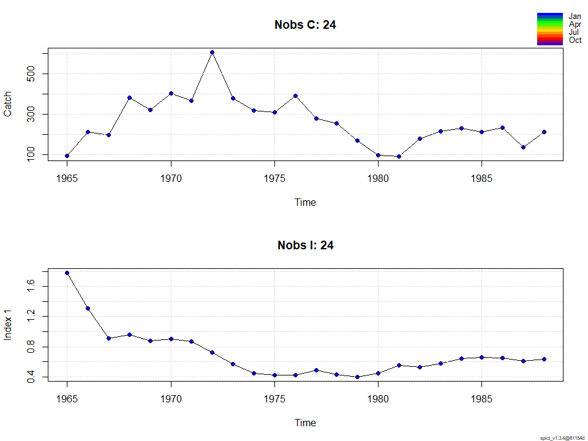
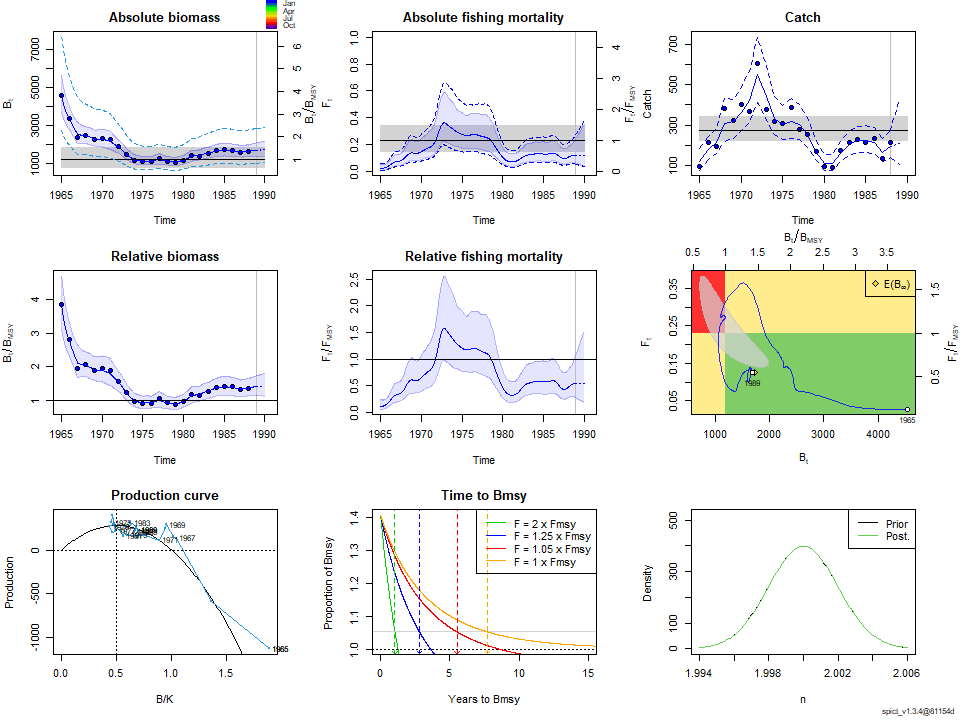
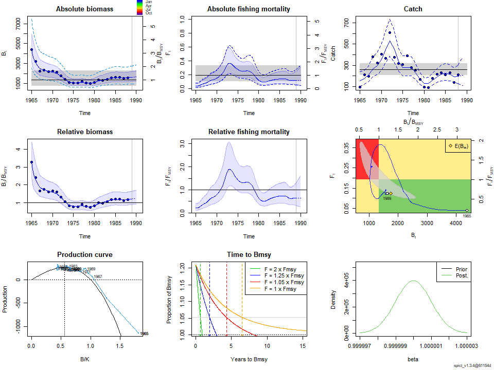
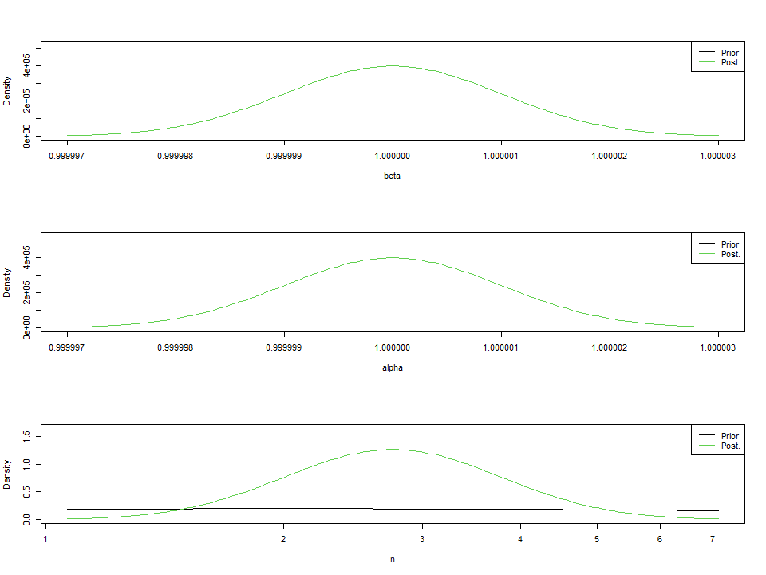
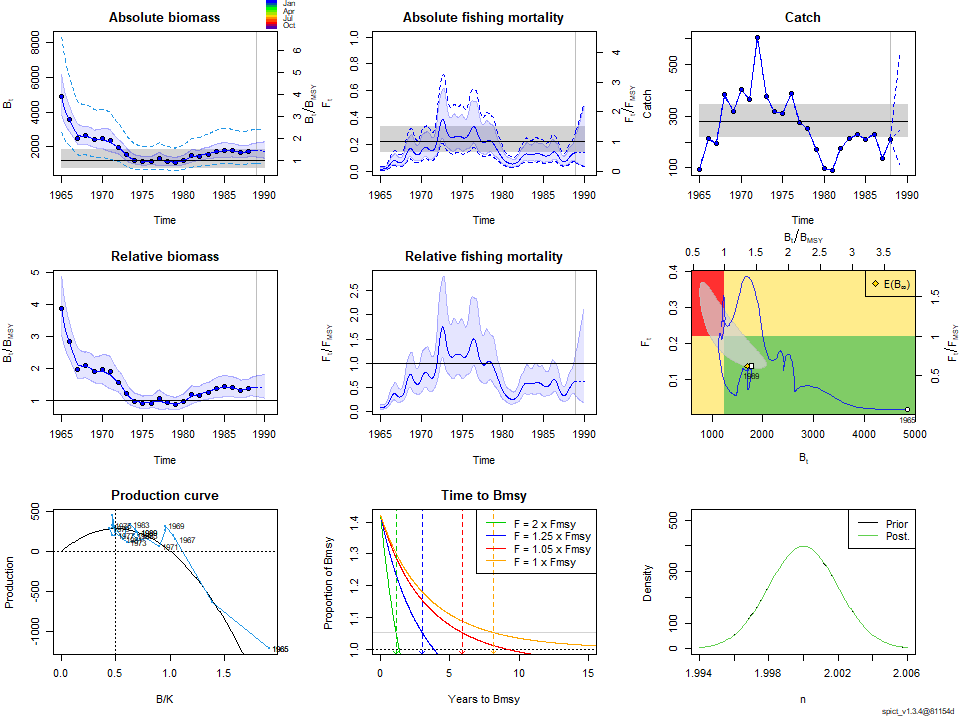
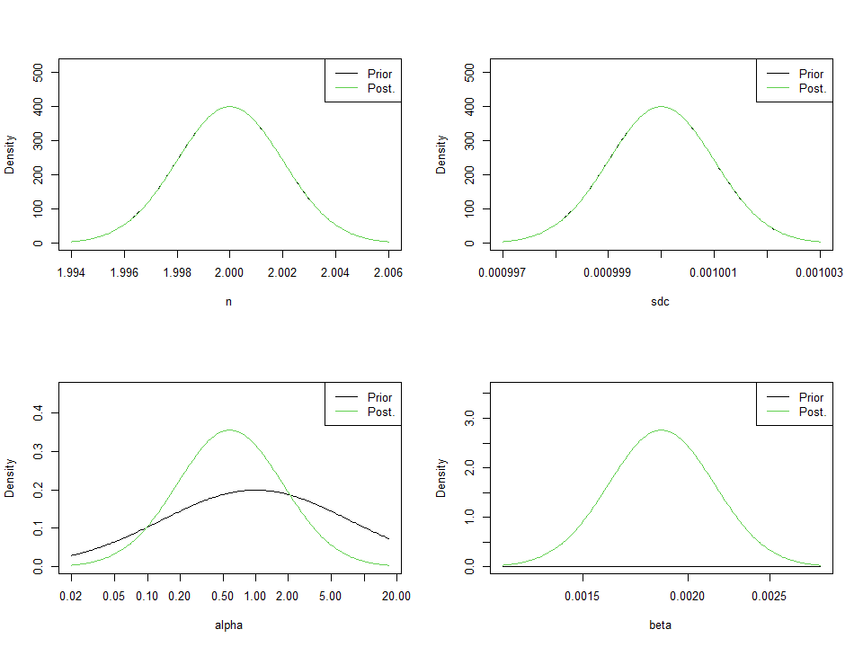
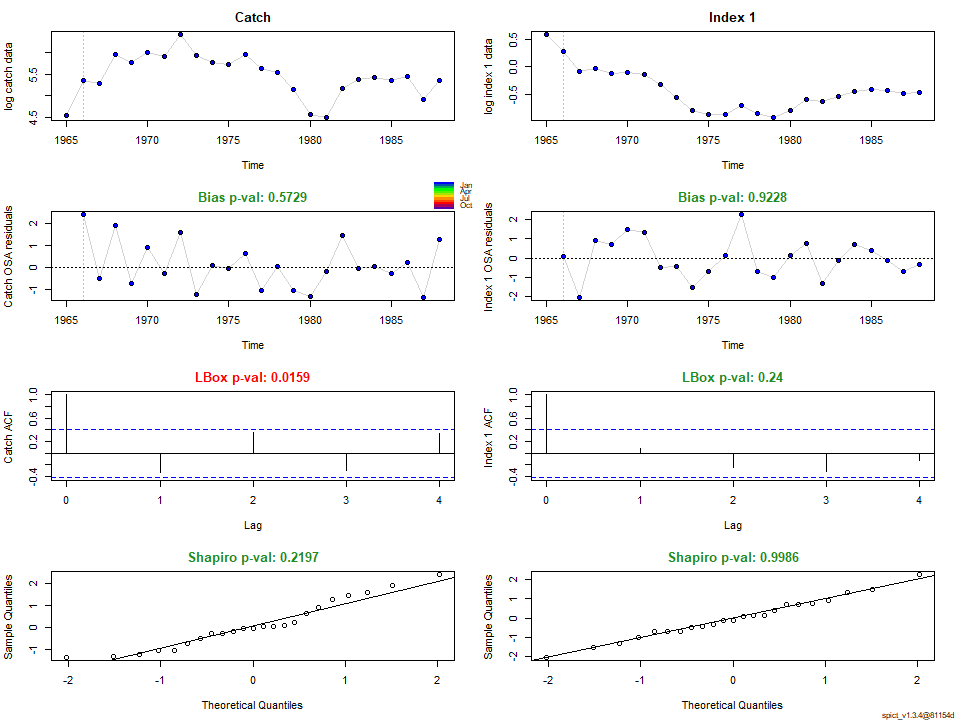
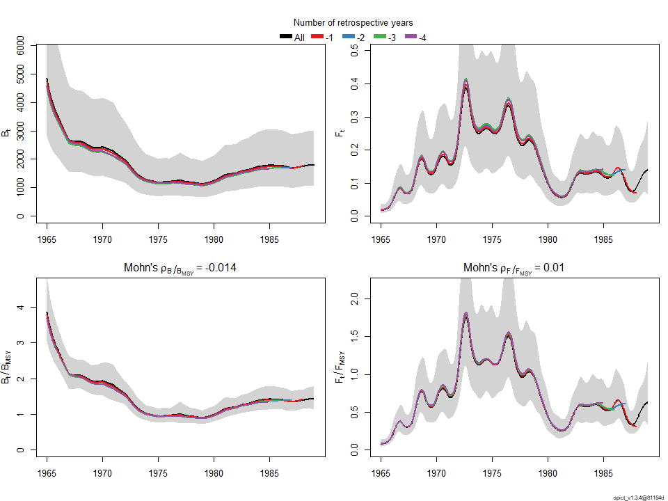
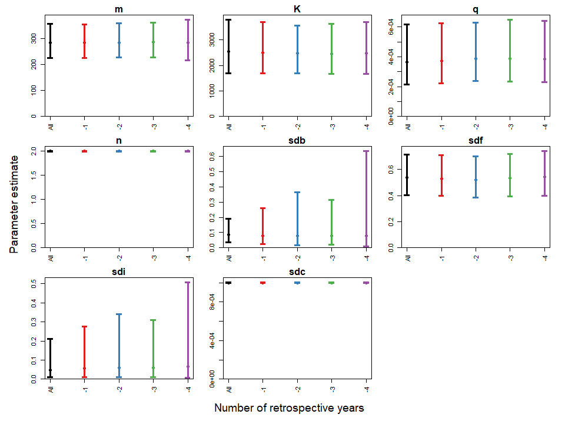

-   [1．準備](#準備)
-   [2. Hakeの解析](#Hakeの解析)
-   [2-1.
    シナリオ1：Schaefer型(n=2),Biomassの過程誤差・Indexの観測誤差あり,Fの過程誤差,Cの観測誤差あり（自由に推定）](#シナリオ1schaefer型n2biomassの過程誤差indexの観測誤差ありfの過程誤差cの観測誤差あり自由に推定)
-   [2-2. シナリオ2：nを推定,alpha=1,
    beta=1と制約のもと](#シナリオ2nを推定alpha1-beta1と制約のもと)
-   [2-3.
    シナリオ3：Schaefer型(n=2),Biomassの過程誤差とIndexの観測誤差あり,Fの過程誤差ありとCの観測誤差なし](#シナリオ3schaefer型n2biomassの過程誤差とindexの観測誤差ありfの過程誤差ありとcの観測誤差なし)

1．準備
-------

``` r
devtools::install_github("DTUAqua/spict/spict") #パッケージのインストール
```

    Error in get(genname, envir = envir) : 
       オブジェクト 'testthat_print' がありません 

``` r
library(spict)#ライブラリーの読み込み  

#1-1　例データの読み込み  

data(pol)
#pol$albacore #data of south atlantic albacore　データの単位はCが1000t, CPUEはkg/100hooks  
#$lobster #data on new zealand rock lobster データの単位はCがt  
pol$hake #data on nothern namibian hake　データの単位はCが1000t  
```

    $obsC
     [1]  93.510 212.444 195.032 382.712 320.430 402.467 365.557 606.084 377.642
    [10] 318.836 309.374 389.020 276.901 254.251 170.006  97.181  90.523 176.532
    [19] 214.181 228.672 212.177 231.179 136.942 212.000

    $timeC
     [1] 1965 1966 1967 1968 1969 1970 1971 1972 1973 1974 1975 1976 1977 1978 1979
    [16] 1980 1981 1982 1983 1984 1985 1986 1987 1988

    $obsI
     [1] 1.78 1.31 0.91 0.96 0.88 0.90 0.87 0.72 0.57 0.45 0.42 0.42 0.49 0.43 0.40
    [16] 0.45 0.55 0.53 0.58 0.64 0.66 0.65 0.61 0.63

    $timeI
     [1] 1965 1966 1967 1968 1969 1970 1971 1972 1973 1974 1975 1976 1977 1978 1979
    [16] 1980 1981 1982 1983 1984 1985 1986 1987 1988

2. Hakeの解析
-------------

``` r
#2-1.　例データのプロット  
plotspict.data(pol$hake)
```



``` r
# 2-2.　time intervalの指定/確認  
inp<-check.inp(pol$hake)
inp$dtc
```

     [1] 1 1 1 1 1 1 1 1 1 1 1 1 1 1 1 1 1 1 1 1 1 1 1 1

2-1. シナリオ1：Schaefer型(n=2),Biomassの過程誤差・Indexの観測誤差あり,Fの過程誤差,Cの観測誤差あり（自由に推定）
----------------------------------------------------------------------------------------------------------------

``` r
# 2-3.　model fit  
# Base Case 
 inp <- pol$hake
 inp$priors$logn<-c(log(2),1e-3) #shape parameter=2 Schaefer型にshape parameterを固定
 #inp$priors$logbeta<-c(log(1),0.001^2) #betaに関するパラメータをfix. beta=1に固定
 
 #inp$priors$logalpha<-c(1,1,0) #alphaに関するpriorをなくす場合の設定
 #inp$priors$logbeta<-c(1,1,0)#betaに関するpriorをなくす場合の設定
 
 ##inp$phases$logsdc<- -1 
 #inp$phases$logsdf<- -1
 #inp$ini$logsdc<-log(0.00001)#漁獲係数に関する過程誤差をほぼなしと仮定したいのだが設定はこれでよいのか？
 #inp$priors$logsdf<-c(log(0.0000001),1e-3) 
 #inp$priors$logsdc<-log(0.0000001)#ここも同様に漁獲量に関する観察誤差をなしと仮定したいのだが設定はこれでよいのか？
 # inp$priors$logsdf<-log(0.0000001)
 
 res_hake2<-fit.spict(inp)

# summary of result
summary(res_hake2)
```

    Convergence: 0  MSG: both X-convergence and relative convergence (5)
    Objective function at optimum: -2.8079635
    Euler time step (years):  1/16 or 0.0625
    Nobs C: 24,  Nobs I1: 24

    Priors
         logn  ~  dnorm[log(2), 0.001^2] (fixed)
     logalpha  ~  dnorm[log(1), 2^2]
      logbeta  ~  dnorm[log(1), 2^2]

    Model parameter estimates w 95% CI 
                estimate        cilow        ciupp    log.est  
     alpha     0.6057577    0.0777672    4.7184727 -0.5012753  
     beta      0.4787822    0.1907514    1.2017341 -0.7365094  
     r         0.4643762    0.3096574    0.6963995 -0.7670603  
     rc        0.4643755    0.3096563    0.6963999 -0.7670618  
     rold      0.4643748    0.3096522    0.6964069 -0.7670634  
     m       279.5169464  224.3535080  348.2438231  5.6330629  
     K      2407.6790324 1601.0116610 3620.7845730  7.7864185  
     q         0.0003888    0.0002318    0.0006522 -7.8524600  
     n         2.0000031    1.9960870    2.0039269  0.6931487  
     sdb       0.0774072    0.0334233    0.1792723 -2.5586751  
     sdf       0.3987663    0.2541566    0.6256557 -0.9193799  
     sdi       0.0468900    0.0125740    0.1748591 -3.0599504  
     sdc       0.1909222    0.0997700    0.3653530 -1.6558893  
     
    Deterministic reference points (Drp)
               estimate       cilow        ciupp   log.est  
     Bmsyd 1203.8402386 800.5052404 1810.3957938  7.093272  
     Fmsyd    0.2321877   0.1548281    0.3481999 -1.460209  
     MSYd   279.5169464 224.3535080  348.2438231  5.633063  
    Stochastic reference points (Srp)
               estimate      cilow        ciupp   log.est rel.diff.Drp  
     Bmsys 1193.8994590 793.482204 1796.3804496  7.084980 -0.008326312  
     Fmsys    0.2307156   0.153918    0.3458314 -1.466570 -0.006380764  
     MSYs   275.4366060 221.838588  341.9843443  5.618358 -0.014814082  

    States w 95% CI (inp$msytype: s)
                        estimate        cilow        ciupp    log.est  
     B_1988.94      1678.5857253 1001.8110774 2812.5562801  7.4257069  
     F_1988.94         0.1249674    0.0579310    0.2695763 -2.0797027  
     B_1988.94/Bmsy    1.4059691    1.1449356    1.7265155  0.3407268  
     F_1988.94/Fmsy    0.5416511    0.2804645    1.0460712 -0.6131333  

    Predictions w 95% CI (inp$msytype: s)
                      prediction        cilow        ciupp    log.est  
     B_1990.00      1697.9521532 1007.3274155 2862.0699390  7.4371782  
     F_1990.00         0.1249675    0.0410367    0.3805588 -2.0797013  
     B_1990.00/Bmsy    1.4221902    1.1217736    1.8030599  0.3521981  
     F_1990.00/Fmsy    0.5416518    0.1913925    1.5329058 -0.6131318  
     Catch_1989.00   211.0506958  104.3218557  426.9708962  5.3520984  
     E(B_inf)       1724.3530870           NA           NA  7.4526072  

``` r
# 2-4.　plot results
plot(res_hake2) #全体的な結果のプロット
```



``` r
plotspict.priors(res_hake2)#shape parameter(n)とalpha,betaの事前分布と事後分布
```


2-2. シナリオ2：nを推定,alpha=1, beta=1と制約のもと
---------------------------------------------------

``` r
# 2-3.　model fit  
# Base Case 
 inp <- pol$hake
 #inp$priors$logn<-c(log(2),1e-3) #shape parameter=2 Schaefer型にshape parameterを固定
 inp$priors$logbeta<-c(log(1),0.001^2) #betaに関するパラメータをfix. beta=1に固定
 inp$priors$logalpha<-c(log(1),0.001^2) #betaに関するパラメータをfix. beta=1に固定
 #inp$priors$logalpha<-c(1,1,0) #alphaに関するpriorをなくす場合の設定
 #inp$priors$logbeta<-c(1,1,0)#betaに関するpriorをなくす場合の設定
 
 ##inp$phases$logsdc<- -1 
 #inp$phases$logsdf<- -1
 #inp$ini$logsdc<-log(0.00001)#漁獲係数に関する過程誤差をほぼなしと仮定したいのだが設定はこれでよいのか？
 #inp$priors$logsdf<-c(log(0.0000001),1e-3) 
 #inp$priors$logsdc<-log(0.0000001)#ここも同様に漁獲量に関する観察誤差をなしと仮定したいのだが設定はこれでよいのか？
 # inp$priors$logsdf<-log(0.0000001)
 
 res_hake3<-fit.spict(inp)

# summary of result
summary(res_hake3)
```

    Convergence: 0  MSG: relative convergence (4)
    Objective function at optimum: -23.0742227
    Euler time step (years):  1/16 or 0.0625
    Nobs C: 24,  Nobs I1: 24

    Priors
      logbeta  ~  dnorm[log(1), 0^2] (fixed)
     logalpha  ~  dnorm[log(1), 0^2] (fixed)
         logn  ~  dnorm[log(2), 2^2]

    Model parameter estimates w 95% CI 
                estimate        cilow        ciupp   log.est  
     alpha     1.0000000    0.9999980    1.0000020  0.000000  
     beta      1.0000000    0.9999980    1.0000020  0.000000  
     r         0.5352673    0.3251328    0.8812125 -0.624989  
     rc        0.3887278    0.2286035    0.6610104 -0.944876  
     rold      0.3051792    0.1366284    0.6816615 -1.186856  
     m       262.9569462  215.6692091  320.6130160  5.571990  
     K      2410.4972919 1556.6278156 3732.7466051  7.787588  
     q         0.0004055    0.0002400    0.0006854 -7.810286  
     n         2.7539443    1.4803034    5.1234152  1.013034  
     sdb       0.0576021    0.0410078    0.0809113 -2.854197  
     sdf       0.2894893    0.2161515    0.3877097 -1.239637  
     sdi       0.0576021    0.0410078    0.0809113 -2.854197  
     sdc       0.2894893    0.2161515    0.3877097 -1.239637  
     
    Deterministic reference points (Drp)
               estimate       cilow        ciupp   log.est  
     Bmsyd 1352.9104850 794.8574529 2302.7610470  7.210013  
     Fmsyd    0.1943639   0.1143017    0.3305052 -1.638023  
     MSYd   262.9569462 215.6692091  320.6130160  5.571990  
    Stochastic reference points (Srp)
               estimate       cilow        ciupp   log.est rel.diff.Drp  
     Bmsys 1345.3076080 792.3712070 2284.0968276  7.204378 -0.005651404  
     Fmsys    0.1929259   0.1124838    0.3308955 -1.645449 -0.007453593  
     MSYs   259.5336850 212.4730966  317.0177059  5.558886 -0.013190046  

    States w 95% CI (inp$msytype: s)
                        estimate       cilow        ciupp    log.est  
     B_1988.94      1627.8971261 961.0274422 2757.5165253  7.3950444  
     F_1988.94         0.1246277   0.0561440    0.2766471 -2.0824241  
     B_1988.94/Bmsy    1.2100557   0.8921826    1.6411829  0.1906664  
     F_1988.94/Fmsy    0.6459878   0.3194270    1.3064024 -0.4369747  

    Predictions w 95% CI (inp$msytype: s)
                      prediction       cilow        ciupp    log.est  
     B_1990.00      1667.0749850 976.6070042 2845.7086563  7.4188259  
     F_1990.00         0.1246279   0.0463600    0.3350325 -2.0824226  
     B_1990.00/Bmsy    1.2391775   0.9063412    1.6942417  0.2144479  
     F_1990.00/Fmsy    0.6459887   0.2586169    1.6135888 -0.4369733  
     Catch_1989.00   205.4389275 110.8759029  380.6521693  5.3251488  
     E(B_inf)       1755.7829461          NA           NA  7.4706702  

``` r
# 2-4.　plot results
plot(res_hake3) #全体的な結果のプロット
```



``` r
plotspict.priors(res_hake3)#shape parameter(n)とalpha,betaの事前分布と事後分布
```



2-3. シナリオ3：Schaefer型(n=2),Biomassの過程誤差とIndexの観測誤差あり,Fの過程誤差ありとCの観測誤差なし
-------------------------------------------------------------------------------------------------------

``` r
# 2-3.　model fit  
# Base Case 
 inp <- pol$hake
 inp$priors$logn<-c(log(2),1e-3) #shape parameter=2 Schaefer型にshape parameterを固定
 
 #inp$phases$logsdc<- -1 #logsdcを固定するフェーズの指定
 #inp$phases$logsdf<- -1#logsdfを固定するフェーズの指定
 #inp$ini$logsdc<-log(0.00001)#漁獲係数に関する過程誤差をほぼなしと仮定したいのだが設定はこれでよいのか？
 #inp$priors$logsdf<-c(log(0.001),1e-3) 
 inp$priors$logsdc<-c(log(0.001),1e-3)#ここも同様に漁獲量に関する観察誤差をなしと仮定したいのだが設定はこれでよいのか
 #inp$priors$logsdf<-c(log(0.001),1e-3)
 
 res_hake<-fit.spict(inp)

# summary of result
summary(res_hake)
```

    Convergence: 0  MSG: both X-convergence and relative convergence (5)
    Objective function at optimum: -2.136183
    Euler time step (years):  1/16 or 0.0625
    Nobs C: 24,  Nobs I1: 24

    Priors
         logn  ~  dnorm[log(2), 0.001^2] (fixed)
       logsdc  ~  dnorm[log(0.001), 0.001^2] (fixed)
     logalpha  ~  dnorm[log(1), 2^2]
      logbeta  ~  dnorm[log(1), 2^2]

    Model parameter estimates w 95% CI 
                estimate        cilow        ciupp    log.est  
     alpha     0.5773189    0.0637736    5.2262559 -0.5493605  
     beta      0.0018591    0.0014001    0.0024686 -6.2876706  
     r         0.4470377    0.2959317    0.6753000 -0.8051124  
     rc        0.4470371    0.2959308    0.6753003 -0.8051137  
     rold      0.4470365    0.2959272    0.6753069 -0.8051149  
     m       283.2924564  225.2358282  356.3137200  5.6464798  
     K      2534.8438602 1695.4569294 3789.7945292  7.8378873  
     q         0.0003644    0.0002155    0.0006161 -7.9173243  
     n         2.0000026    1.9960865    2.0039263  0.6931485  
     sdb       0.0846812    0.0373013    0.1922431 -2.4688611  
     sdf       0.5378997    0.4050943    0.7142439 -0.6200831  
     sdi       0.0488881    0.0112692    0.2120870 -3.0182216  
     sdc       0.0010000    0.0009980    0.0010020 -6.9077537  
     
    Deterministic reference points (Drp)
               estimate       cilow        ciupp   log.est  
     Bmsyd 1267.4225543 847.7278909 1894.9004138  7.144741  
     Fmsyd    0.2235186   0.1479654    0.3376501 -1.498261  
     MSYd   283.2924564 225.2358282  356.3137200  5.646480  
    Stochastic reference points (Srp)
               estimate       cilow        ciupp   log.est rel.diff.Drp  
     Bmsys 1254.5382454 840.5387803 1872.4492503  7.134523 -0.010270160  
     Fmsys    0.2217542   0.1467256    0.3351488 -1.506186 -0.007956349  
     MSYs   278.1763942 222.7239468  347.4350531  5.628255 -0.018391432  

    States w 95% CI (inp$msytype: s)
                        estimate        cilow        ciupp    log.est  
     B_1988.94      1783.5440164 1060.7805812 2998.7627176  7.4863577  
     F_1988.94         0.1384343    0.0673195    0.2846735 -1.9773592  
     B_1988.94/Bmsy    1.4216737    1.1386369    1.7750664  0.3518348  
     F_1988.94/Fmsy    0.6242693    0.3397087    1.1471948 -0.4711735  

    Predictions w 95% CI (inp$msytype: s)
                      prediction        cilow       ciupp    log.est  
     B_1990.00      1768.1354194 1034.2901066 3022.655676  7.4776808  
     F_1990.00         0.1384345    0.0375731    0.510049 -1.9773579  
     B_1990.00/Bmsy    1.4093914    1.0833568    1.833546  0.3431580  
     F_1990.00/Fmsy    0.6242701    0.1796680    2.169074 -0.4711722  
     Catch_1989.00   245.7725773  112.8922627  535.060227  5.5044066  
     E(B_inf)       1702.6459870           NA          NA  7.4399388  

``` r
# 2-4.　plot results
plot(res_hake) #全体的な結果のプロット
```



``` r
plotspict.priors(res_hake)#shape parameter(n)とalpha,betaの事前分布と事後分布
```



``` r
# 2-5.　Residuals and diagnostics 残差診断
res<-calc.osa.resid(res_hake)
plotspict.diagnostic(res)
```



``` r
# 2-6.　Retrospective plots レトロ解析
res<-retro(res_hake,nretroyear=4)
plotspict.retro(res)
```



          FFmsy       BBmsy 
     0.01048623 -0.01355169 

``` r
plotspict.retro.fixed(res)
```



``` r
mohns_rho(res,what=c("FFmsy","BBmsy")) #モーンズローの値
```

          FFmsy       BBmsy 
     0.01048623 -0.01355169
