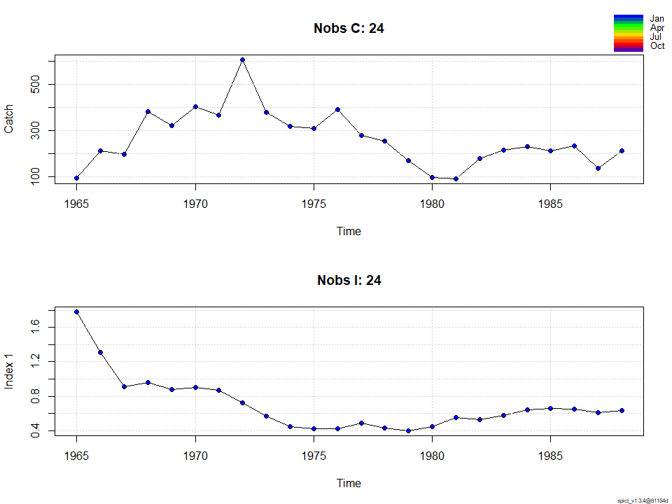
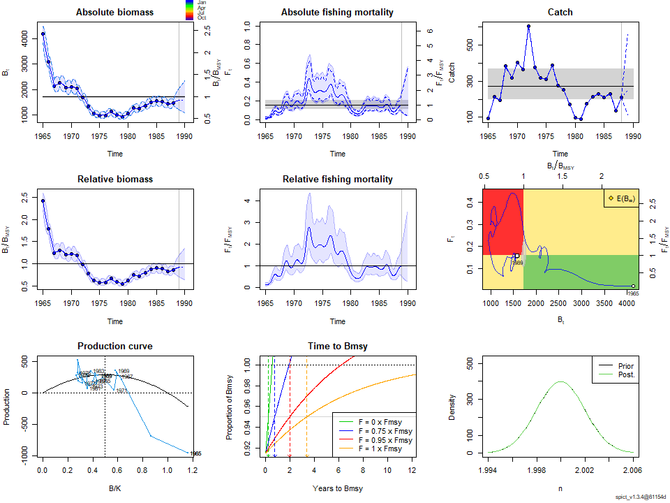
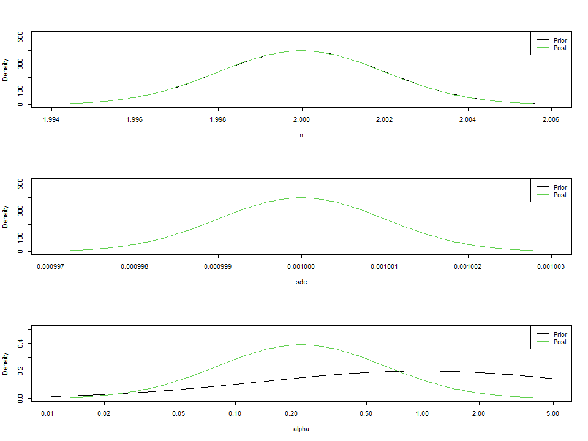
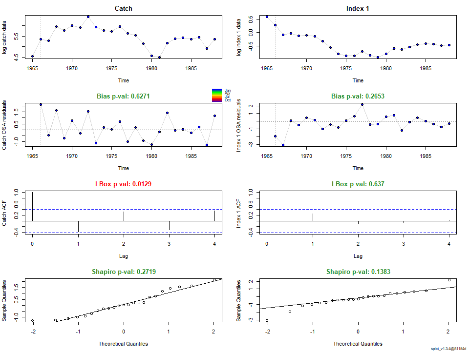
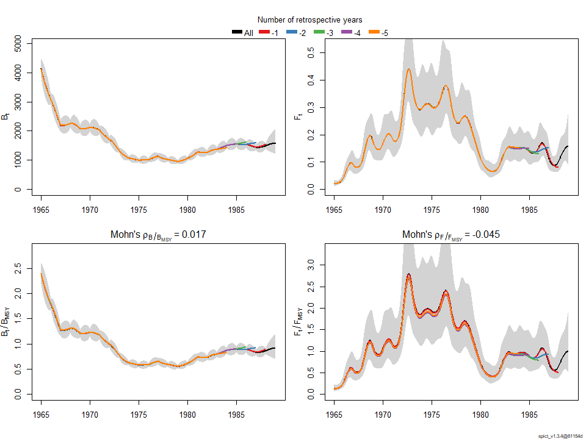
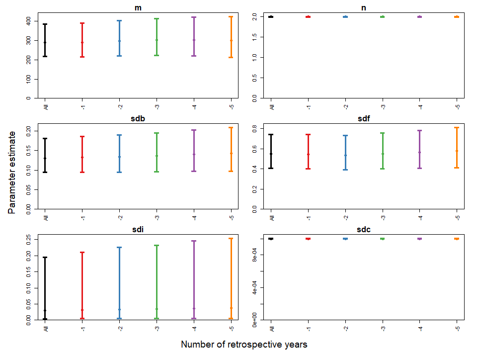

-   [1．準備](#準備)
-   [2. Hakeの解析](#hakeの解析)
-   [番外編.
    濱邉さん推定K,qにfix,Schaefer型(n=2),Biomassの過程誤差とIndexの観測誤差あり,Fの過程誤差ありとCの観測誤差なし](#番外編.-濱邉さん推定kqにfixschaefer型n2biomassの過程誤差とindexの観測誤差ありfの過程誤差ありとcの観測誤差なし)

1．準備
-------

``` r
devtools::install_github("DTUAqua/spict/spict") #パッケージのインストール
```

    Error in get(genname, envir = envir) : 
       オブジェクト 'testthat_print' がありません 

``` r
library(spict)#ライブラリーの読み込み  

#1-1　例データの読み込み  

data(pol)
#pol$albacore #data of south atlantic albacore　データの単位はCが1000t, CPUEはkg/100hooks  
#$lobster #data on new zealand rock lobster データの単位はCがt  
pol$hake #data on nothern namibian hake　データの単位はCが1000t  
```

    $obsC
     [1]  93.510 212.444 195.032 382.712 320.430 402.467 365.557 606.084 377.642
    [10] 318.836 309.374 389.020 276.901 254.251 170.006  97.181  90.523 176.532
    [19] 214.181 228.672 212.177 231.179 136.942 212.000

    $timeC
     [1] 1965 1966 1967 1968 1969 1970 1971 1972 1973 1974 1975 1976 1977 1978 1979
    [16] 1980 1981 1982 1983 1984 1985 1986 1987 1988

    $obsI
     [1] 1.78 1.31 0.91 0.96 0.88 0.90 0.87 0.72 0.57 0.45 0.42 0.42 0.49 0.43 0.40
    [16] 0.45 0.55 0.53 0.58 0.64 0.66 0.65 0.61 0.63

    $timeI
     [1] 1965 1966 1967 1968 1969 1970 1971 1972 1973 1974 1975 1976 1977 1978 1979
    [16] 1980 1981 1982 1983 1984 1985 1986 1987 1988

2. Hakeの解析
-------------

``` r
#2-1.　例データのプロット  
plotspict.data(pol$hake)
```



``` r
# 2-2.　time intervalの指定/確認  
inp<-check.inp(pol$hake)
inp$dtc
```

     [1] 1 1 1 1 1 1 1 1 1 1 1 1 1 1 1 1 1 1 1 1 1 1 1 1

番外編. 濱邉さん推定K,qにfix,Schaefer型(n=2),Biomassの過程誤差とIndexの観測誤差あり,Fの過程誤差ありとCの観測誤差なし
--------------------------------------------------------------------------------------------------------------------

``` r
# 2-3.　model fit  
# Base Case 
 inp <- pol$hake
 inp$priors$logn<-c(log(2),1e-3) #shape parameter=2 Schaefer型にshape parameterを固定
 
 inp$phases$logq<- -1 #logqを固定するフェーズの指定
 inp$phases$logK<- -1
 #inp$phases$logr<- -1

 inp$priors$logsdc<-c(log(0.001),1e-3)#logsdcをほぼ0にする
 inp$ini$logq <- log(0.0004248)
 #inp$ini$logr <- log(0.3335362)
 inp$ini$logK <- log(3562.6967130)
 inp$priors$logbeta<-c(1,1,0)
 res_hake<-fit.spict(inp)

# summary of result
summary(res_hake)
```

    Convergence: 0  MSG: both X-convergence and relative convergence (5)
    Objective function at optimum: 1.9003071
    Euler time step (years):  1/16 or 0.0625
    Nobs C: 24,  Nobs I1: 24

    Priors
         logn  ~  dnorm[log(2), 0.001^2] (fixed)
       logsdc  ~  dnorm[log(0.001), 0.001^2] (fixed)
     logalpha  ~  dnorm[log(1), 2^2]

    Fixed parameters
        fixed.value  
     q    0.0004248  
     K 3562.6967130  

    Model parameter estimates w 95% CI 
               estimate       cilow       ciupp    log.est  
     alpha    0.2257007   0.0302857   1.6820067 -1.4885456  
     beta     0.0018161   0.0013479   0.0024469 -6.3110789  
     r        0.3242870   0.2428941   0.4329543 -1.1261264  
     rc       0.3242879   0.2428957   0.4329537 -1.1261237  
     rold     0.3242887   0.2428941   0.4329589 -1.1261210  
     m      288.8345209 216.3407492 385.6202810  5.6658539  
     n        1.9999946   1.9960786   2.0039184  0.6931445  
     sdb      0.1302685   0.0940863   0.1803651 -2.0381572  
     sdf      0.5506388   0.4086773   0.7419130 -0.5966763  
     sdi      0.0294017   0.0044323   0.1950373 -3.5267028  
     sdc      0.0010000   0.0009980   0.0010020 -6.9077552  
     
    Deterministic reference points (Drp)
               estimate        cilow        ciupp   log.est  
     Bmsyd 1781.3465073 1779.9983189 1782.6957168  7.485125  
     Fmsyd    0.1621439    0.1214479    0.2164769 -1.819271  
     MSYd   288.8345209  216.3407492  385.6202810  5.665854  
    Stochastic reference points (Srp)
               estimate        cilow        ciupp   log.est rel.diff.Drp  
     Bmsys 1726.1510062 1690.5546794 1762.4968493  7.453649  -0.03197606  
     Fmsys    0.1579345    0.1176822    0.2119548 -1.845575  -0.02665300  
     MSYs   272.3864530  201.7276812  367.7947386  5.607222  -0.06038504  

    States w 95% CI (inp$msytype: s)
                        estimate        cilow        ciupp    log.est  
     B_1988.94      1579.0541404 1220.4577751 2043.0137194  7.3645813  
     F_1988.94         0.1576672    0.0910738    0.2729539 -1.8472685  
     B_1988.94/Bmsy    0.9147833    0.7067498    1.1840521 -0.0890681  
     F_1988.94/Fmsy    0.9983078    0.5266246    1.8924648 -0.0016937  

    Predictions w 95% CI (inp$msytype: s)
                      prediction        cilow        ciupp    log.est  
     B_1990.00      1601.7142960 1094.8489060 2343.2353744  7.3788298  
     F_1990.00         0.1576674    0.0456056    0.5450872 -1.8472674  
     B_1990.00/Bmsy    0.9279109    0.6345813    1.3568295 -0.0748196  
     F_1990.00/Fmsy    0.9983090    0.2766815    3.6020502 -0.0016925  
     Catch_1989.00   250.7958218  112.4493501  559.3500021  5.5246391  
     E(B_inf)       1592.9555373           NA           NA  7.3733464  

``` r
# 2-4.　plot results
plot(res_hake) #全体的な結果のプロット
```



``` r
plotspict.priors(res_hake)#shape parameter(n)とalpha,betaの事前分布と事後分布
```



``` r
# 2-5.　Residuals and diagnostics 残差診断
res<-calc.osa.resid(res_hake)
plotspict.diagnostic(res)
```



``` r
# 2-6.　Retrospective plots レトロ解析
res<-retro(res_hake,nretroyear=5)
plotspict.retro(res)
```



          FFmsy       BBmsy 
    -0.04481191  0.01723991 

``` r
plotspict.retro.fixed(res)
```



``` r
mohns_rho(res,what=c("FFmsy","BBmsy")) #モーンズローの値
```

          FFmsy       BBmsy 
    -0.04481191  0.01723991
