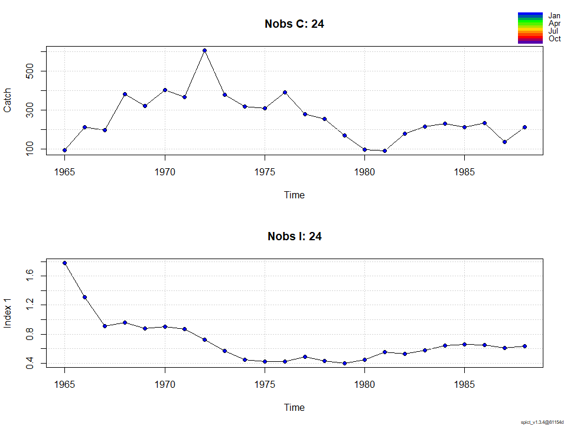

-   [1．準備](#準備)
-   [2. test\_data(ここではHake)の解析](#test_dataここではhakeの解析)
-   [2-1.
    シナリオ1：Schaefer型(n=2),BiomassとFの過程誤差あり・IndexとCatchのの観測誤差あり（自由に推定）](#シナリオ1schaefer型n2biomassとfの過程誤差ありindexとcatchのの観測誤差あり自由に推定)
-   [2-2. シナリオ2：nを推定させる,alpha=1,
    beta=1と制約を置く](#シナリオ2nを推定させるalpha1-beta1と制約を置く)
-   [2-3.
    シナリオ3：Schaefer型(n=2),BiomassとFの過程誤差あり，Indexの観測誤差あり，Cの観測誤差なし](#シナリオ3schaefer型n2biomassとfの過程誤差ありindexの観測誤差ありcの観測誤差なし)

1．準備
-------

``` r
#詳しい説明はspict_guidelines.pdfやspict_handbook.pdfを参照してください

devtools::install_github("DTUAqua/spict/spict") #パッケージのインストール
```

    Error in get(genname, envir = envir) : 
       オブジェクト 'testthat_print' がありません 

``` r
library(spict)#ライブラリーの読み込み  

#1-1　データの読み込み  
test_data<-read.csv("example.csv")
test_data<-as.list(test_data) #リスト形式に変換　
```

2. test\_data(ここではHake)の解析
---------------------------------

``` r
#2-1.　Catchと資源量指標値データのプロット  
plotspict.data(test_data)
```



``` r
# 2-2.　time intervalの指定/確認  
inp<-check.inp(test_data)
inp$dtc #time-intervalの指定．特に指定しない場合は，データの最初の観察値を1とし，その次の観察値は1年後とみなされるのでtime-intervalは1となる
```

     [1] 1 1 1 1 1 1 1 1 1 1 1 1 1 1 1 1 1 1 1 1 1 1 1 1

2-1. シナリオ1：Schaefer型(n=2),BiomassとFの過程誤差あり・IndexとCatchのの観測誤差あり（自由に推定）
----------------------------------------------------------------------------------------------------

``` r
 inp <- test_data

 #shape parameterを固定したい場合は下記で定める
 inp$priors$logn<-c(log(2),1e-3) #shape parameter=2 Schaefer型にshape parameterを固定
 
 #その他の過程誤差，観測誤差に関してはとりあえずデフォルトのゆるいpriorをあてて推定させてみる
 #(どんなゆるいpriorをあてているかはsummaryを実行したときのPriorsというところに出てくる)
 
 #実行するためのコマンド
 res_hake2<-fit.spict(inp)

 #結果を要約する
 summary(res_hake2)
```

    Convergence: 0  MSG: both X-convergence and relative convergence (5)
    Objective function at optimum: -2.8079635
    Euler time step (years):  1/16 or 0.0625
    Nobs C: 24,  Nobs I1: 24

    Priors
         logn  ~  dnorm[log(2), 0.001^2] (fixed)
     logalpha  ~  dnorm[log(1), 2^2]
      logbeta  ~  dnorm[log(1), 2^2]

    Model parameter estimates w 95% CI 
                estimate        cilow        ciupp    log.est  
     alpha     0.6057577    0.0777672    4.7184727 -0.5012753  
     beta      0.4787822    0.1907514    1.2017341 -0.7365094  
     r         0.4643762    0.3096574    0.6963995 -0.7670603  
     rc        0.4643755    0.3096563    0.6963999 -0.7670618  
     rold      0.4643748    0.3096522    0.6964069 -0.7670634  
     m       279.5169464  224.3535080  348.2438231  5.6330629  
     K      2407.6790324 1601.0116610 3620.7845730  7.7864185  
     q         0.0003888    0.0002318    0.0006522 -7.8524600  
     n         2.0000031    1.9960870    2.0039269  0.6931487  
     sdb       0.0774072    0.0334233    0.1792723 -2.5586751  
     sdf       0.3987663    0.2541566    0.6256557 -0.9193799  
     sdi       0.0468900    0.0125740    0.1748591 -3.0599504  
     sdc       0.1909222    0.0997700    0.3653530 -1.6558893  
     
    Deterministic reference points (Drp)
               estimate       cilow        ciupp   log.est  
     Bmsyd 1203.8402386 800.5052404 1810.3957938  7.093272  
     Fmsyd    0.2321877   0.1548281    0.3481999 -1.460209  
     MSYd   279.5169464 224.3535080  348.2438231  5.633063  
    Stochastic reference points (Srp)
               estimate      cilow        ciupp   log.est rel.diff.Drp  
     Bmsys 1193.8994590 793.482204 1796.3804496  7.084980 -0.008326312  
     Fmsys    0.2307156   0.153918    0.3458314 -1.466570 -0.006380764  
     MSYs   275.4366060 221.838588  341.9843443  5.618358 -0.014814082  

    States w 95% CI (inp$msytype: s)
                        estimate        cilow        ciupp    log.est  
     B_1988.94      1678.5857253 1001.8110774 2812.5562801  7.4257069  
     F_1988.94         0.1249674    0.0579310    0.2695763 -2.0797027  
     B_1988.94/Bmsy    1.4059691    1.1449356    1.7265155  0.3407268  
     F_1988.94/Fmsy    0.5416511    0.2804645    1.0460712 -0.6131333  

    Predictions w 95% CI (inp$msytype: s)
                      prediction        cilow        ciupp    log.est  
     B_1990.00      1697.9521532 1007.3274155 2862.0699390  7.4371782  
     F_1990.00         0.1249675    0.0410367    0.3805588 -2.0797013  
     B_1990.00/Bmsy    1.4221902    1.1217736    1.8030599  0.3521981  
     F_1990.00/Fmsy    0.5416518    0.1913925    1.5329058 -0.6131318  
     Catch_1989.00   211.0506958  104.3218557  426.9708962  5.3520984  
     E(B_inf)       1724.3530870           NA           NA  7.4526072  

``` r
# 2-4.　plot results
plot(res_hake2) #全体的な結果のプロット
```


``` r
plotspict.priors(res_hake2)#shape parameter(n)とalpha,betaの事前分布と事後分布
```


2-2. シナリオ2：nを推定させる,alpha=1, beta=1と制約を置く
---------------------------------------------------------

``` r
 inp <- pol$hake

 inp$priors$logbeta<-c(log(1),0.001^2) #betaに関するパラメータをfix. beta=1に固定
 inp$priors$logalpha<-c(log(1),0.001^2) #alphaに関するパラメータをfix. beta=1に固定
 
 #inp$priors$logalpha<-c(1,1,0) #alphaに関するpriorをなくす場合の設定
 #inp$priors$logbeta<-c(1,1,0)#betaに関するpriorをなくす場合の設定
 
 res_hake3<-fit.spict(inp)

# summary of result
 summary(res_hake3)
```

    Convergence: 0  MSG: relative convergence (4)
    Objective function at optimum: -23.0742227
    Euler time step (years):  1/16 or 0.0625
    Nobs C: 24,  Nobs I1: 24

    Priors
      logbeta  ~  dnorm[log(1), 0^2] (fixed)
     logalpha  ~  dnorm[log(1), 0^2] (fixed)
         logn  ~  dnorm[log(2), 2^2]

    Model parameter estimates w 95% CI 
                estimate        cilow        ciupp   log.est  
     alpha     1.0000000    0.9999980    1.0000020  0.000000  
     beta      1.0000000    0.9999980    1.0000020  0.000000  
     r         0.5352673    0.3251328    0.8812125 -0.624989  
     rc        0.3887278    0.2286035    0.6610104 -0.944876  
     rold      0.3051792    0.1366284    0.6816615 -1.186856  
     m       262.9569462  215.6692091  320.6130160  5.571990  
     K      2410.4972919 1556.6278156 3732.7466051  7.787588  
     q         0.0004055    0.0002400    0.0006854 -7.810286  
     n         2.7539443    1.4803034    5.1234152  1.013034  
     sdb       0.0576021    0.0410078    0.0809113 -2.854197  
     sdf       0.2894893    0.2161515    0.3877097 -1.239637  
     sdi       0.0576021    0.0410078    0.0809113 -2.854197  
     sdc       0.2894893    0.2161515    0.3877097 -1.239637  
     
    Deterministic reference points (Drp)
               estimate       cilow        ciupp   log.est  
     Bmsyd 1352.9104850 794.8574529 2302.7610470  7.210013  
     Fmsyd    0.1943639   0.1143017    0.3305052 -1.638023  
     MSYd   262.9569462 215.6692091  320.6130160  5.571990  
    Stochastic reference points (Srp)
               estimate       cilow        ciupp   log.est rel.diff.Drp  
     Bmsys 1345.3076080 792.3712070 2284.0968276  7.204378 -0.005651404  
     Fmsys    0.1929259   0.1124838    0.3308955 -1.645449 -0.007453593  
     MSYs   259.5336850 212.4730966  317.0177059  5.558886 -0.013190046  

    States w 95% CI (inp$msytype: s)
                        estimate       cilow        ciupp    log.est  
     B_1988.94      1627.8971261 961.0274422 2757.5165253  7.3950444  
     F_1988.94         0.1246277   0.0561440    0.2766471 -2.0824241  
     B_1988.94/Bmsy    1.2100557   0.8921826    1.6411829  0.1906664  
     F_1988.94/Fmsy    0.6459878   0.3194270    1.3064024 -0.4369747  

    Predictions w 95% CI (inp$msytype: s)
                      prediction       cilow        ciupp    log.est  
     B_1990.00      1667.0749850 976.6070042 2845.7086563  7.4188259  
     F_1990.00         0.1246279   0.0463600    0.3350325 -2.0824226  
     B_1990.00/Bmsy    1.2391775   0.9063412    1.6942417  0.2144479  
     F_1990.00/Fmsy    0.6459887   0.2586169    1.6135888 -0.4369733  
     Catch_1989.00   205.4389275 110.8759029  380.6521693  5.3251488  
     E(B_inf)       1755.7829461          NA           NA  7.4706702  

``` r
# 2-4.　plot results
plot(res_hake3) #全体的な結果のプロット
```


``` r
plotspict.priors(res_hake3)#shape parameter(n)とalpha,betaの事前分布と事後分布
```


``` r
# 2-5.　Residuals and diagnostics 残差診断
res<-calc.osa.resid(res_hake3)
plotspict.diagnostic(res)
```


``` r
# 2-6.　Retrospective plots レトロ解析
res<-retro(res_hake3,nretroyear=5)
plotspict.retro(res)
```


          FFmsy       BBmsy 
    -0.01234212 -0.02800252 

``` r
plotspict.retro.fixed(res)
```


``` r
mohns_rho(res,what=c("FFmsy","BBmsy")) #モーンズローの値
```

          FFmsy       BBmsy 
    -0.01234212 -0.02800252 

2-3. シナリオ3：Schaefer型(n=2),BiomassとFの過程誤差あり，Indexの観測誤差あり，Cの観測誤差なし
----------------------------------------------------------------------------------------------

``` r
 inp <- pol$hake
 inp$priors$logn<-c(log(2),1e-3) #shape parameter=2 Schaefer型にshape parameterを固定
 

 inp$priors$logsdc<-c(log(0.001),1e-3)#漁獲量に関する観察誤差をほぼなしと仮定するための設定
 inp$priors$logbeta<-c(1,1,0)#betaに関するpriorはなくしておく
 
 res_hake<-fit.spict(inp)

# summary of result
summary(res_hake)
```

    Convergence: 0  MSG: relative convergence (4)
    Objective function at optimum: -5.2953627
    Euler time step (years):  1/16 or 0.0625
    Nobs C: 24,  Nobs I1: 24

    Priors
         logn  ~  dnorm[log(2), 0.001^2] (fixed)
       logsdc  ~  dnorm[log(0.001), 0.001^2] (fixed)
     logalpha  ~  dnorm[log(1), 2^2]

    Model parameter estimates w 95% CI 
                estimate        cilow        ciupp    log.est  
     alpha     0.5743521    0.0634165    5.2018063 -0.5545127  
     beta      0.0017992    0.0013421    0.0024121 -6.3203948  
     r         0.4470386    0.2960115    0.6751208 -0.8051103  
     rc        0.4470381    0.2960106    0.6751211 -0.8051115  
     rold      0.4470375    0.2960070    0.6751277 -0.8051128  
     m       283.3584775  225.2763663  356.4156689  5.6467128  
     K      2535.4292251 1695.0218973 3792.5181768  7.8381182  
     q         0.0003641    0.0002152    0.0006161 -7.9179770  
     n         2.0000025    1.9960864    2.0039263  0.6931484  
     sdb       0.0847776    0.0375251    0.1915316 -2.4677235  
     sdf       0.5557924    0.4145854    0.7450942 -0.5873604  
     sdi       0.0486922    0.0111643    0.2123672 -3.0222362  
     sdc       0.0010000    0.0009980    0.0010020 -6.9077552  
     
    Deterministic reference points (Drp)
              estimate       cilow        ciupp   log.est  
     Bmsyd 1267.715227 847.5103705 1896.2622211  7.144971  
     Fmsyd    0.223519   0.1480053    0.3375605 -1.498259  
     MSYd   283.358477 225.2763663  356.4156689  5.646713  
    Stochastic reference points (Srp)
               estimate       cilow        ciupp   log.est rel.diff.Drp  
     Bmsys 1254.7986098 840.3765744 1873.5881023  7.134730 -0.010293777  
     Fmsys    0.2217507   0.1467487    0.3350856 -1.506202 -0.007974404  
     MSYs   278.2295769 222.7296042  347.5590851  5.628447 -0.018434060  

    States w 95% CI (inp$msytype: s)
                        estimate        cilow        ciupp    log.est  
     B_1988.94      1783.5953912 1060.0172060 3001.0951723  7.4863865  
     F_1988.94         0.1384329    0.0664955    0.2881946 -1.9773698  
     B_1988.94/Bmsy    1.4214196    1.1384578    1.7747112  0.3516561  
     F_1988.94/Fmsy    0.6242726    0.3350390    1.1631970 -0.4711681  

    Predictions w 95% CI (inp$msytype: s)
                      prediction        cilow        ciupp    log.est  
     B_1990.00      1768.2779820 1032.9418961 3027.0889712  7.4777615  
     F_1990.00         0.1384331    0.0362094    0.5292472 -1.9773684  
     B_1990.00/Bmsy    1.4092126    1.0817635    1.8357803  0.3430311  
     F_1990.00/Fmsy    0.6242735    0.1729147    2.2538128 -0.4711667  
     Catch_1989.00   245.7838154  110.0711137  548.8241364  5.5044524  
     E(B_inf)       1702.9408294           NA           NA  7.4401119  

``` r
# 2-4.　plot results
plot(res_hake) #全体的な結果のプロット
```


``` r
plotspict.priors(res_hake)#shape parameter(n)とalpha,betaの事前分布と事後分布
```


``` r
# 2-5.　Residuals and diagnostics 残差診断
res<-calc.osa.resid(res_hake)
plotspict.diagnostic(res)
```


``` r
# 2-6.　Retrospective plots レトロ解析
res<-retro(res_hake,nretroyear=5)
plotspict.retro(res)
```


          FFmsy       BBmsy 
     0.01771116 -0.01836890 

``` r
plotspict.retro.fixed(res)
```


``` r
mohns_rho(res,what=c("FFmsy","BBmsy")) #モーンズローの値
```

          FFmsy       BBmsy 
     0.01771116 -0.01836890
